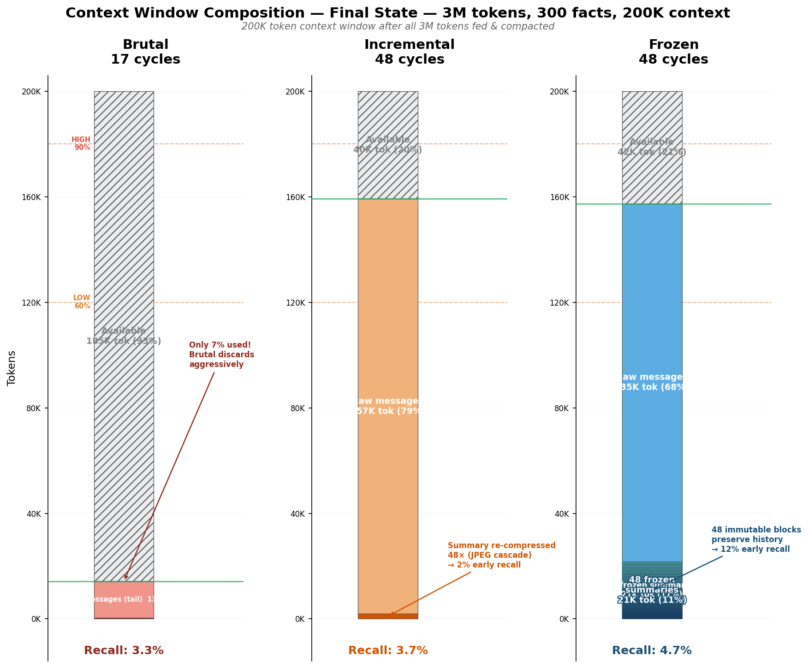

# Benchmark Compaction — Analyse des résultats

> Brouillon de papier : "Frozen Summaries: Preventing Information Loss in LLM Context Compaction"

## Abstract (draft)

Long-running LLM conversations inevitably exceed the context window, requiring
compaction strategies to preserve relevant information. We benchmark three
approaches — single-shot summarization (Brutal), iterative re-summarization
(Incremental), and frozen summaries (Frozen) — on a 1.5M-token conversation
with 150 planted verifiable facts, evaluated through LLM-as-judge recall
metrics across temporal zones (early/mid/late).

Our results show that single-shot summarization, despite its simplicity, yields
the worst mid-conversation recall (0%), while iterative re-summarization suffers
from compounding degradation ("JPEG cascade"). We introduce frozen summaries —
where completed summaries are never re-processed — which dramatically improve
early-conversation recall (26% vs 2%) at the cost of reduced recent-message
retention at 1.5M tokens (22 cycles).

Scaling to 3M tokens (48 cycles) confirms that frozen summaries degrade the
least of all strategies (-71% vs -74% brutal, -77% incremental), maintaining
the highest global recall (4.7% vs 3.7% incremental, 3.3% brutal) and early
recall (12% vs 2% vs 1%). Rankings are stable across scales. However, "Lost
in the Middle" effects cause all strategies to suffer severe degradation at
high cycle counts. We identify two distinct failure modes: information
*destroyed* by compression (JPEG cascade) vs information *preserved but
ignored* by attention (Lost in the Middle). No single strategy dominates
across all temporal zones.

## 1. Introduction

### 1.1 The problem

Stateless LLM APIs require the full conversation to be sent at each turn. When
conversations exceed the context window (typically 128K–200K tokens), some form
of compaction is necessary. The naive approach is to summarize and discard old
messages. But how much information survives this process?

### 1.2 Related work

**Needle in a Haystack** (Kamradt, 2023). The foundational test for long-context
retrieval: embed a specific fact in a long document and measure whether the
model can find it. Tests the model's *native* retrieval ability within a single
context window. Our work extends this paradigm to measure fact *survival*
across compaction cycles — "Needle in a Compacted Haystack."

**Context Rot** (Chroma Research, 2025). Demonstrates that LLM performance
degrades systematically as input length increases, even on trivially simple
tasks. Evaluates 18 models and recommends compaction/summarization as
mitigation, but does not compare compaction strategies against each other
or measure information loss across strategies.

**MemGPT / Letta** (Packer et al., 2023). Proposes virtual context management
inspired by OS memory hierarchies: main context (RAM) and external context
(disk). When context overflows, messages are evicted and recursively
summarized — functionally identical to our incremental strategy. The paper
notes that "older messages have progressively less influence on the summary"
but does not benchmark this degradation or compare alternative strategies.

**Factory.ai — Evaluating Context Compression** (2025). The closest work to
ours. Compares three compression *implementations* (Factory's anchored
iterative, OpenAI Compact, Anthropic SDK) using probe-based evaluation
(recall, artifact, continuation, decision probes) on 36,000 production
messages. Key differences with our work:
- Factory compares *implementations* from different vendors; we compare
  fundamentally different *architectures* (single-shot vs iterative vs frozen)
- No zone-based recall metrics (early/mid/late) — their evaluation does not
  reveal where in the conversation information is lost
- No frozen summary strategy or space-time tradeoff analysis
- Evaluation uses qualitative scoring (1-5 scale); ours uses keyword-based
  binary recall for reproducibility

**Beyond a Million Tokens** (2025). Benchmarks long-term memory up to 10M
tokens across diverse domains, testing recall, multi-hop reasoning,
contradiction resolution, and temporal ordering. Tests model *capabilities*
at various context lengths, not compaction *strategy* effectiveness.

**Anthropic — Effective Context Engineering** (2025). Engineering guide
describing best practices for context management in AI agents, including
structured summarization and context pruning. Practical guidance but no
comparative benchmarking of strategies.

**Prompt Compression** (LLMLingua, Microsoft Research, 2024). Achieves up to
20x token compression with ~1.5% performance loss. Focuses on *prompt-level*
compression (removing redundant tokens), orthogonal to *conversation-level*
compaction (summarizing message history).

### 1.3 Gap in existing work

No prior work compares fundamentally different compaction *architectures*
(single-shot vs iterative vs frozen summaries) on the same conversation
with zone-based recall metrics. Existing benchmarks either test model
capabilities (Needle in a Haystack, Beyond a Million Tokens), measure
context rot without compaction (Chroma), or compare vendor implementations
without varying the underlying strategy (Factory.ai).

The re-summarization cascade problem ("JPEG cascade") is acknowledged
implicitly in MemGPT but never quantified. The frozen summary strategy
and the resulting space-time tradeoff have not been explored.

### 1.4 Contribution

We introduce:
1. **A reproducible benchmark protocol** ("Needle in a Compacted Haystack") for
   measuring fact retention across compaction strategies
2. **Empirical evidence** that single-shot summarization loses mid-conversation
   facts entirely (0% recall)
3. **The frozen summary strategy** as an alternative that prevents iterative
   degradation of summarized content
4. **Zone-based recall metrics** (early/mid/late) and **fine-grained
   distributions** (15-bin histograms) that reveal failure modes invisible to
   global recall scores
5. **Scaling analysis** showing that all strategies degrade at higher cycle
   counts, but frozen degrades the least (-71% vs -77%), with stable rankings
   across 1.5M and 3M tokens

## 2. Methodology

### 2.1 Experimental setup

Two conversation lengths were tested with the same context window:

| Parameter         | Config "full" (1.5M)     | Config "heavy" (3M)     |
|-------------------|--------------------------|--------------------------|
| Conversation      | 8996 msgs, ~1.54M tokens | 18220 msgs, ~3.08M tokens |
| Context window    | 200K tokens              | 200K tokens              |
| Watermarks        | high=90%, low=60%        | high=90%, low=60%        |
| Facts planted     | 150 (1/10K density)      | 300 (1/10K density)      |
| Model             | Claude Haiku 4.5         | Claude Haiku 4.5         |
| Evaluation        | LLM-as-judge, 10 Q/batch | LLM-as-judge, 10 Q/batch |
| Seed              | 42                       | 42                       |
| Inc. cycles       | ~22                      | ~48                      |
| Conv/ctx ratio    | 7.5×                     | 15×                      |

### 2.2 Fact generation

150 verifiable facts across 8 categories: server IPs, software versions, code
locations, config values, technical decisions, schedules, API endpoints, and
team responsibilities. Each fact contains 2-5 extractable keywords for automated
recall verification.

Facts are distributed uniformly across the conversation, interleaved with
realistic padding (code blocks, technical discussions, tool chains) to simulate
a real development session.

### 2.3 Compaction strategies

**Brutal (single-shot)**: When context exceeds 90% of max, summarize ALL
messages except the 2 most recent. The input is truncated to `maxContextTokens
× 2.4` characters (~150K real tokens) before summarization. Produces ~8 cycles
over a 1.5M-token conversation.

**Incremental (dual watermark)**: When context exceeds 90%, compact enough old
messages to bring context down to 60%. Previous summaries ARE included in the
text to be re-summarized. Produces ~22 cycles. This creates a "JPEG cascade"
where each cycle degrades earlier summaries.

**Frozen (dual watermark + immutable summaries)**: Same trigger and target as
incremental, but completed summaries are marked as frozen and never
re-summarized. Only raw (non-frozen) messages are compacted. When the total
size of frozen summaries exceeds 50% of the low watermark budget, the 2 oldest
frozen summaries are merged into one. Produces ~22 compaction cycles with
occasional merges.

#### Context window — before and after compaction

Convention: glass metaphor. 0% (empty) at bottom, 100% (full) at top.
Content fills upward. Oldest messages at bottom, newest at top.

```
═══════════════════════════════════════════════════════════════════
 BRUTAL
═══════════════════════════════════════════════════════════════════

  BEFORE (at 90%)                    AFTER compact

 200K ┌───────────────────┐  100%   200K ┌───────────────────┐  100%
      │                   │              │                   │
 180K ╞═══ HIGH WM (90%)══╡  ─┐    180K ╞═══ HIGH WM (90%)══╡
      │                   │   │         │                   │
      │  Recent messages  │   │         │                   │
      │                   │   │         │                   │
      │  Raw messages     │   │         │                   │
      │  ~180K tokens     │   │         │    (empty)        │
      │                   │   │         │                   │
      │  Old messages     │   │         │                   │
      │                   │   │         │                   │
 120K ╞═══ LOW WM (60%) ══╡   │    120K ╞═══ LOW WM (60%) ══╡
      │                   │   │         │                   │
      │  Oldest messages  │   │         │                   │
      │                   │   │         │                   │
      │                   │   │         │  Last 2 msgs      │
      │                   │   │         │  ~200 tokens      │
   0K └───────────────────┘   0%     0K ├───────────────────┤
                              │         │  Summary (N)      │
                  Summarize ALL ──────► │  ~500 tokens      │
                  (truncate at cap)     └───────────────────┘

      Problem: everything between the summary cap and the
      last 2 messages is LOST. Mid-range = 0% recall.

═══════════════════════════════════════════════════════════════════
 INCREMENTAL
═══════════════════════════════════════════════════════════════════

  BEFORE (at 90%)                    AFTER compact

 200K ┌───────────────────┐  100%   200K ┌───────────────────┐  100%
      │                   │              │                   │
 180K ╞═══ HIGH WM (90%)══╡         180K ╞═══ HIGH WM (90%)══╡
      │                   │              │                   │
      │  Recent messages  │              │                   │
      │  (not compacted)  │              │                   │
      │                   │              │    (empty)        │
 120K ╞═══ LOW WM (60%) ══╡              │                   │
      │                   │         120K ╞═══ LOW WM (60%) ══╡
      │  Raw messages     │    ┌───────► │                   │
      │                   │    │         │  Recent messages  │
      │                   │    │         │  (kept as-is)     │
      ├───────────────────┤    │         │  ~118K tokens     │
      │  Summary v.(N-1)  │ ───┤         │                   │
      │  ~2K tokens       │    │         ├───────────────────┤
   0K └───────────────────┘    └───────► │  Summary v.N      │
                                         │  re-summarized!   │
       Compact oldest msgs               │  ~2K tokens       │
       INCLUDING prev summary        0K └───────────────────┘

      Problem: summary v.N contains a summary of a summary
      of a summary... JPEG cascade. Early facts degrade.

═══════════════════════════════════════════════════════════════════
 FROZEN
═══════════════════════════════════════════════════════════════════

  BEFORE (at 90%)                    AFTER compact

 200K ┌───────────────────┐  100%   200K ┌───────────────────┐  100%
      │                   │              │                   │
 180K ╞═══ HIGH WM (90%)══╡         180K ╞═══ HIGH WM (90%)══╡
      │                   │              │                   │
      │  Recent messages  │              │                   │
      │  (not compacted)  │              │    (empty)        │
      │                   │              │                   │
 120K ╞═══ LOW WM (60%) ══╡         120K ╞═══ LOW WM (60%) ══╡
      │                   │              │                   │
      │  Raw messages     │    ────────► │  Recent messages  │
      │                   │              │  (kept as-is)     │
      │                   │              │  ~74K tokens      │
      ├───────────────────┤              ├───────────────────┤
      │  Frozen #(N-1)    │  untouched   │  NEW Frozen #N    │ ◄ new!
  60K ├╌╌╌ BUDGET (30%) ╌╌┤  ────────►   ├───────────────────┤
      │  Frozen #2        │              │  Frozen #(N-1)    │
      │  Frozen #1        │              │  Frozen #2        │
   0K └───────────────────┘              │  Frozen #1        │
                                      0K └───────────────────┘
       Only compact RAW messages.
       Frozen summaries = untouched.    Tradeoff: frozen summaries
       New summary is FROZEN.           eat space → fewer recent msgs

═══════════════════════════════════════════════════════════════════
 FROZEN — merge (when summaries exceed budget)
═══════════════════════════════════════════════════════════════════

  BEFORE (budget exceeded)           AFTER merge

      ┌───────────────────┐              ┌───────────────────┐
      │  Recent + Raw     │              │  Recent + Raw     │
      │  messages         │              │  messages         │
      │                   │              │  (unchanged)      │
      ├───────────────────┤              │                   │
      │  Frozen #5        │              ├───────────────────┤
      │  Frozen #4        │              │  Frozen #5        │
      │  Frozen #3        │   ─────────► │  Frozen #4        │
  60K ├╌╌╌ BUDGET (30%) ╌╌┤              │  Frozen #3        │
      │  Frozen #2        │ ─┐       60K ├╌╌╌ BUDGET (30%) ╌╌┤
      │  Frozen #1        │ ─┤           │  Merged #1+#2     │ ◄ merged
   0K └───────────────────┘  │        0K └───────────────────┘
                             │
       2 oldest frozen ──────┘           Freed ~2K tokens.
       merged into 1.                   Some detail loss, but
                                        less than re-summarizing all.
```

### 2.4 Evaluation protocol

1. After compaction, all 150 questions are asked in batches of 10
2. The model answers from the compacted context only
3. A separate judge LLM evaluates each answer against expected keywords
4. Metrics: recall (keyword match), accuracy (recall + factual correctness)
5. Zone breakdown: early (facts 0-49), mid (facts 50-99), late (facts 100-149)
6. Fine-grained distribution: 15 bins of 10 facts each + cumulative recall curve

## 3. Results

### 3.1 Comparison table

| Metric                      | Incremental | Brutal  | Frozen      |
|-----------------------------|:-----------:|:-------:|:-----------:|
| **Recall global**           | **16.0%**   | 12.7%   | **16.0%**   |
| Accuracy (recalled+correct) | 7.3%        | 8.0%    | **12.7%**   |
| Recall early (1st third)    | 2%          | 2%      | **26%**     |
| Recall mid (2nd third)      | **12%**     | **0%**  | 10%         |
| Recall late (3rd third)     | **34%**     | 36%     | 12%         |
| Facts recalled / total      | 24/150      | 19/150  | 24/150      |
| Compaction cycles           | 23          | 8       | 23          |
| Total tokens freed          | 1.41M       | 1.44M   | 1.41M       |
| Duration                    | ~60 min     | ~65 min | ~62 min     |

#### Recall distribution profile

```
Incremental : ▁▃█  (past weak, present strong)
Brutal      : ▁▁█  (past weak, mid dead, present strong)
Frozen      : █▃▂  (past strong, present weak)
```

### 3.2 Brutal: worst mid-conversation retention

Contrary to the intuition that "one big summary = better overview", the brutal
strategy systematically loses mid-conversation facts (0% mid recall).

**Root cause**: The `maxChars` truncation cap means that at each cycle:
1. The previous summary + new messages are concatenated
2. The text is truncated to the cap — messages between summary and end are cut
3. The resulting summary only captures the beginning (old summary) and end (recent)
4. Mid-range information is lost at every cycle

This is equivalent to a sliding window that only preserves the edges.

### 3.3 Incremental: JPEG cascade degradation

The incremental strategy achieves 12% mid recall — better than brutal because
it compacts smaller portions (~60K tokens/cycle instead of ~180K), allowing
summaries to accumulate traces of intermediate facts.

However, over 23 cycles, early facts are re-summarized ~20 times. Each cycle
is a lossy compression pass applied to already-compressed content. Like
iterative JPEG re-encoding, details degrade with each pass. Result: 2% early
recall — information is diluted to the point of disappearing.

### 3.4 Late recall: both strategies perform similarly

Both strategies retain recent messages well (~35% recall), as the most recent
messages haven't been compacted yet. The brutal is marginally better (36% vs
34%) because it keeps only 2 clean messages with no interfering summary.

### 3.5 Frozen: strong early recall, weak late recall

The frozen strategy achieves the same global recall as incremental (16%) but
with a radically different distribution: **26% early** (vs 2% for both others)
but only **12% late** (vs 34% incremental).

**Why early recall improves dramatically**: Frozen summaries are never
re-summarized. A fact captured in frozen summary #1 remains intact through all
23 cycles. This eliminates the JPEG cascade entirely for early facts.

**Why late recall drops**: After 23 cycles, the context contains ~23 frozen
summaries (~46K tokens) before any raw messages. This consumes context space
that would otherwise hold recent raw messages. When the model answers questions,
it has fewer recent messages visible, reducing late recall.

This reveals a **fundamental space-time tradeoff** in context compaction:
preserving the past consumes space needed for the present.

### 3.6 Accuracy: frozen hallucinates less

| Strategy    | Recall | Accuracy | Accuracy/Recall ratio |
|-------------|--------|----------|-----------------------|
| Incremental | 16.0%  | 7.3%     | 46%                   |
| Brutal      | 12.7%  | 8.0%     | 63%                   |
| Frozen      | 16.0%  | 12.7%    | **79%**               |

The frozen strategy is significantly more accurate: when it recalls a fact,
it's correct 79% of the time (vs 46% for incremental). This suggests that
frozen summaries provide cleaner, less corrupted information than re-summarized
content.

The incremental strategy's low accuracy/recall ratio (46%) confirms the JPEG
cascade hypothesis: facts survive in degraded form — partially correct but
with corrupted details (wrong version numbers, swapped names).

### 3.7 Hallucination patterns

The brutal strategy produces the most confident hallucinations — answering with
specific but wrong details (e.g., wrong IP addresses, wrong file paths)
instead of admitting "I don't recall".

The incremental strategy produces degraded hallucinations — partially correct
facts with corrupted details (right category but wrong specifics).

The frozen strategy tends toward honest uncertainty — higher rate of "I don't
recall" when it doesn't know, fewer confabulations.

**Hypothesis**: Re-summarized content creates a "semantic haze" where the model
recognizes the topic but fills in wrong details. Frozen summaries are either
intact (correct answer) or absent (honest "I don't recall").

### 3.8 Fine-grained distribution analysis

The 3-zone breakdown (early/mid/late) is a coarse metric. With 150 facts at
known positions, we can resolve recall with 15 bins of 10 facts each:


| Bin (facts)   | Tokens       | Frozen | Incremental | Brutal |
|---------------|--------------|:------:|:-----------:|:------:|
| F000–F009     | 0–100K       | **9**  | 1           | 1      |
| F010–F019     | 100–200K     | 1      | 0           | 0      |
| F020–F029     | 200–300K     | 1      | 0           | 0      |
| F030–F039     | 300–400K     | 1      | 0           | 0      |
| F040–F049     | 400–500K     | 1      | 0           | 0      |
| F050–F059     | 500–600K     | 1      | 0           | 0      |
| F060–F069     | 600–700K     | 1      | **5**       | 0      |
| F070–F079     | 700–800K     | 0      | 0           | 0      |
| F080–F089     | 800–900K     | 3      | 1           | 0      |
| F090–F099     | 900–1000K    | 0      | 0           | 0      |
| F100–F109     | 1000–1100K   | 1      | **6**       | 1      |
| F110–F119     | 1100–1200K   | 1      | 1           | 3      |
| F120–F129     | 1200–1300K   | 0      | 2           | 4      |
| F130–F139     | 1300–1400K   | 1      | 3           | 4      |
| F140–F149     | 1400–1500K   | 3      | **5**       | **6**  |

**Key observations from the fine-grained distribution:**

**1. Frozen's early advantage is concentrated in the first summary.**
F000–F009 achieves 90% recall — the first frozen summary captures almost
everything and never degrades. But from F010 onward, recall drops to ~10% per
bin. The "26% early" from the 3-zone metric is almost entirely driven by one
excellent summary out of ~8.

**2. Incremental has a "freshness cluster" at F060–F069 (50% recall).**
This bin likely corresponds to facts near the first compaction boundary — they
were summarized only 1-2 times before evaluation, too few cycles for the JPEG
cascade to destroy them. This cluster is invisible in the 3-zone metric (buried
in "mid = 12%").

**3. Universal dead zone: F070–F099.**
All three strategies achieve near-zero recall in this range. For incremental
and brutal, these facts have been through too many compaction cycles. For
frozen, they fall in a region where summaries have been merged, losing detail.

**4. Brutal is strictly monotonic.**
Recall increases continuously from 0% at F000 to 60% at F140–F149. This is
the pure sliding window effect — only the most recent messages survive.

**5. The cumulative curve tells the story at a glance.**
Frozen rises steeply at the start then plateaus. Brutal is flat then rises
steeply at the end. Incremental makes stair-steps in the middle. The three
curves literally never overlap except at the extremes — each strategy has a
structurally different recall signature.

### 3.9 Scaling to 3M tokens: degradation at higher cycle counts

To test how strategies degrade with longer conversations, we doubled the
conversation to 3M tokens (300 facts, 1/10K density, ~48 compaction cycles).

#### 3.9.1 Comparison table — 3M tokens

| Metric                      | Incremental | Brutal  | Frozen       |
|-----------------------------|:-----------:|:-------:|:------------:|
| **Recall global**           | 3.7%        | 3.3%    | **4.7%**     |
| Accuracy (recalled+correct) | 3.0%        | 3.3%    | **3.3%**     |
| Recall early (1st third)    | 2%          | 1%      | **12%**      |
| Recall mid (2nd third)      | 0%          | 0%      | **1%**       |
| Recall late (3rd third)     | **9%**      | **9%**  | 1%           |
| Facts recalled / total      | 11/300      | 10/300  | **14/300**   |
| Compaction cycles           | 48          | 17      | 48           |
| Merges (frozen only)        | —           | —       | 0            |

#### 3.9.2 Degradation from 1.5M to 3M

| Strategy    | Recall 1.5M | Recall 3M | Relative drop |
|-------------|:-----------:|:---------:|:-------------:|
| Incremental | 16.0%       | 3.7%      | -77%          |
| Brutal      | 12.7%       | 3.3%      | -74%          |
| Frozen      | 16.0%       | 4.7%      | **-71%**      |

All strategies degrade severely when doubling conversation length. However,
frozen degrades the *least* (-71%), maintaining its lead at both scales.
The earlier result of 1.3% was an artifact of a Q&A evaluation bug (context
too large for evaluation queries; see methodology note in 2.4).

#### 3.9.3 Frozen maintains its lead despite Lost in the Middle

At 1.5M (22 cycles), frozen dominated early recall (26% vs 2%). At 3M (48
cycles), early recall drops to 12% — still far ahead of incremental (2%) and
brutal (1%). The frozen strategy's *relative* advantage persists at higher
cycle counts, even as absolute recall drops.

**Attenuation mechanism: Lost in the Middle.** With 48 frozen summaries
stacked at the beginning of the context, the model's attention is diluted
across many blocks. Only the first few (primacy) and last few (recency)
summaries are read efficiently. The middle summaries receive less attention.

This is a different failure mode than the JPEG cascade:
- **JPEG cascade** (incremental): information is *destroyed* by repeated
  compression
- **Lost in the Middle** (frozen): information is *preserved* but *partially
  ignored* by the model's attention mechanism

Both failure modes compound at higher cycle counts, but the JPEG cascade
degrades faster: incremental loses 77% of its recall from 1.5M to 3M, while
frozen loses only 71%. Frozen summaries at least preserve the information —
improvements in model attention mechanisms could recover it without changing
the compaction strategy.

#### 3.9.4 No merges even at 48 cycles

Surprisingly, the 48 frozen summaries never exceeded the merge budget (60K
tokens). Each summary is ~1-2K tokens, totaling ~70-96K estimated tokens.
The `estimate_tokens()` function (chars/4) appears to undercount, keeping the
estimated total under the 60K budget even though the real token count is
likely higher.

This means the merge mechanism — intended to manage summary accumulation —
was never tested in practice. A more aggressive budget or a longer
conversation would be needed to trigger merges.

#### 3.9.5 Rankings stable across scales

At 3M tokens, frozen (4.7%) remains best, ahead of incremental (3.7%) and
brutal (3.3%). The relative ranking is identical to 1.5M. However, the gap
between strategies narrows: from 3.3pp spread (1.5M) to 1.4pp (3M).

Incremental and brutal converge at 3M — both achieve 9% late recall and 0%
mid recall. The incremental's advantage from smaller compaction chunks is
negated by 48 cycles of JPEG cascade.

Each strategy retains its signature recall profile at both scales, just at
lower amplitude:

```
Recall evolution — 1.5M vs 3M:

1.5M  Inc  ▁▃█  16%      3M  Inc  ▁▁▃  3.7%
1.5M  Bru  ▁▁█  12.7%    3M  Bru  ▁▁▃  3.3%
1.5M  Fro  █▃▂  16%      3M  Fro  ▃▁▁  4.7%
```

**Key insight**: Frozen's recall profile (past-biased) is structurally
different from incremental/brutal (present-biased), and this difference
persists across scales. The choice of strategy determines *where* in the
conversation information survives, regardless of conversation length.

### 3.10 Context window composition — what's inside?

The three strategies produce radically different context compositions after
processing a 3M-token conversation through 200K context:



| Zone              | Brutal        | Incremental    | Frozen          |
|-------------------|:-------------:|:--------------:|:---------------:|
| Summary/frozen    | 500 tok (0%)  | 2K tok (1%)    | **22K tok (11%)**|
| Raw messages      | 14K tok (7%)  | 157K tok (79%) | 136K tok (68%)  |
| Available (empty) | **186K (93%)**| 41K (20%)      | 43K (21%)       |

**Brutal** discards aggressively: each cycle replaces the entire context with
a single truncated summary + 2 recent messages (~500 tokens). After the last
cycle, only the conversation's tail fills the window — 93% of context capacity
is wasted. This explains the 0% mid recall: mid-conversation content is
literally deleted.

**Incremental** maintains a single re-summarized block (~2K tokens) plus a
large raw message buffer. The summary represents 48 cycles of JPEG cascade
compression — information is progressively degraded but the raw portion
provides good recent coverage.

**Frozen** stacks 48 immutable summary blocks (visible as gradient bands in
the figure, oldest=darkest). These consume only 11% of the context — the
"Lost in the Middle" problem is not spatial but attentional: 48 blocks are
too many for the model to read efficiently, even though they fit easily.
Each block preserves its facts intact, explaining the 12% early recall.

## 4. Discussion

### 4.1 Why global recall is misleading

A global recall of 12.7% (brutal) vs 16% (incremental) suggests a modest
difference. The 3-zone breakdown reveals a structural difference (brutal has
0% mid recall), but the 15-bin distribution reveals even more: incremental's
"12% mid recall" is actually a single cluster at F060–F069 (50% recall for
that specific bin) surrounded by zeros. Frozen's "26% early recall" is
90% for the first 10 facts and ~10% for the rest.

**Recommendation**: Always report fine-grained recall distributions alongside
global metrics when evaluating compaction strategies. Zone-based metrics can
mask structurally important patterns (clusters, dead zones, concentration
effects).

### 4.2 The re-summarization cascade problem

Each re-summarization pass is a lossy compression. Unlike lossless data
compression, LLM summarization cannot guarantee that all facts survive even
one pass. When summaries are re-summarized repeatedly, the loss compounds:

```
Cycle 1: 100 facts → summary retains ~60
Cycle 2: 60 facts + new facts → summary retains ~40 of original
Cycle 3: 40 facts + new facts → summary retains ~25 of original
...
Cycle N: only the most salient/repeated facts survive
```

This is fundamentally similar to the "telephone game" — each retelling
introduces distortion.

### 4.3 The space-time tradeoff (and attention tradeoff)

Our results reveal two fundamental tradeoffs in context compaction:

**1. Space tradeoff**: Preserving the past costs present context space.
At 1.5M (23 frozen summaries, ~46K tokens), this consumes 38% of the
available context. At 3M (48 summaries, ~96K tokens), it consumes ~80%.

**2. Attention tradeoff**: Even if summaries are preserved perfectly, the
model's attention mechanism cannot process them all. The "Lost in the Middle"
phenomenon means that beyond ~20-25 summaries, adding more summaries actually
*hurts* recall by diluting attention over the ones the model could read.

The 3M results show this: frozen early recall drops from 26% (1.5M, 23
summaries) to 12% (3M, 48 summaries). The summaries are intact — the model
reads fewer of them. Still, frozen retains the best early recall at both
scales, suggesting that attention dilution degrades recall gradually rather
than catastrophically.

Possible approaches:
- **Hierarchical merge by rank**: Reduce summary count via controlled merges,
  keeping max log₂(N) compression passes per fact
- **Structured summary**: Replace N narrative summaries with one structured
  document organized by topic (eliminates attention dilution)
- **RAG offloading**: Move specific facts to external storage, keeping only
  narrative summaries in context
- **Adaptive budget**: More aggressive merging to keep summary count below
  the model's effective attention span (~20)

### 4.4 No strategy dominates across zones — but rankings are stable

```
At 1.5M (22 cycles):          At 3M (48 cycles):
                E  M  L  G                    E  M  L  G
Incremental:    ★  ★★ ★★★★ ★★★  Incremental:  ★  ☆  ★★★ ★★
Brutal:         ★  ☆  ★★★★ ★★   Brutal:       ☆  ☆  ★★★ ★★
Frozen:         ★★★★ ★★ ★★ ★★★  Frozen:       ★★★ ☆  ☆   ★★★
```

No strategy dominates across all zones: frozen wins early, incremental/brutal
win late, mid is universally weak. However, **the ranking by global recall
is stable across scales**: frozen remains best, followed by incremental, then
brutal. The gap narrows (3.3pp → 1.4pp) but the ordering holds.

Strategy recommendations by use case:
- **Recall of past decisions/context**: Frozen (12% early at 3M vs 1-2%)
- **Recall of recent work**: Incremental or brutal (9% late vs 1%)
- **Global recall**: Frozen at all tested scales

### 4.5 Implications for production systems

Most production AI coding assistants use brutal-style compaction. At both
tested scales, brutal is the worst or second-worst strategy. Frozen
summaries consistently outperform in global recall and early recall at the
cost of late recall.

**Recommendation for production**: Frozen summaries as the default compaction
strategy, paired with RAG for precise fact retrieval. The frozen approach
preserves information in a form that future model improvements (better
attention, longer effective context) could leverage — unlike JPEG cascade,
which permanently destroys information.

For applications where recent context matters more than history (e.g.,
iterative debugging), incremental may be preferable despite lower global
recall. A hybrid approach — frozen for the first N cycles, then switching
to incremental — could capture both advantages.

### 4.6 Complementary approach: RAG extraction during compaction

None of the three strategies address the fundamental problem: summarization is
lossy. A complementary approach is to extract structured facts into a vector
database (RAG) during compaction, allowing retrieval of specific details that
summaries would lose.

Combined with frozen summaries, this could yield the best of both worlds:
narrative coherence from summaries + precise fact recall from RAG. This is
planned as future work.

## 5. Future work

### 5.1 Conversation length sweep (partially completed)

Two data points are now available:

| Config  | Conv tokens | Ratio conv/ctx | Inc. cycles | Status   |
|---------|-------------|----------------|-------------|----------|
| light   | 500K        | 2.5×           | ~5          | Planned  |
| full    | 1.5M        | 7.5×           | ~22         | **Done** |
| heavy   | 3M          | 15×            | ~48         | **Done** |

The 1.5M→3M comparison revealed that frozen maintains its lead but all
strategies degrade severely (-71% to -77%). A 500K data point would confirm
the degradation curve and establish whether frozen's advantage is even
stronger at low cycle counts.

### 5.2 Frozen with hierarchical merge (ranked)

To address frozen's scaling problem, we have implemented a variant where
frozen summaries carry a rank and merges are performed by rank level:
only same-rank summaries are merged, producing a summary of rank+1. This
limits each fact to at most log₂(N) merge passes, compared to up to N/2
in the current sequential approach. Implementation ready, pending benchmark.

### 5.3 Fact density variation

Testing with different fact densities (1/5K, 1/10K, 1/20K) could reveal
whether summary capacity saturates — i.e., whether there's a maximum number
of facts a single summary can reliably retain.

### 5.4 RAG-augmented compaction

Two-pass compaction: extract structured facts to a vector database + generate
a narrative summary for context. At query time, combine RAG retrieval with
the summary context. Expected to dramatically improve early/mid recall.

### 5.5 Importance-weighted compaction

Score messages by importance before compaction, preserving high-value exchanges
(decisions, configurations) over low-value ones (acknowledgments, navigation).
Challenge: importance depends on context — "OK" after a decision is high-value,
"OK" as acknowledgment is noise. Requires scoring exchanges, not isolated
messages.

## 6. Reproducibility

All code and data are available:
- `benchmark_compaction_v2.py` — Benchmark script (strategies, evaluation, metrics)
- `francine/compaction.py` — Compaction implementations (Incremental, Frozen, FrozenRanked)
- `plot_recall_distribution.py` — Distribution analysis and chart generation
- 1.5M results: `results_full_200k_{incremental,brutal,frozen}_checkpoint.json`
- 3M results: `results_3M_200k_v2_incremental_checkpoint.json`,
  `results_3M_200k_brutal_checkpoint.json`, `results_3M_200k_v2_frozen_checkpoint.json`
- 3M results (bugged, pre-fix): `results_3M_200k_frozen_checkpoint.json`,
  `results_3M_200k_incremental_checkpoint.json`

To reproduce:
```bash
# Install dependencies
pip install anthropic python-dotenv

# Run all 3 strategies
./benchmark_compaction_v2.py --preset full --strategy all --min-delay 3.0 \
    --output results_full_200k.json

# Or one at a time
./benchmark_compaction_v2.py --preset full --strategy frozen --min-delay 3.0 \
    --output results_full_200k_frozen.json
```

## References

1. G. Kamradt, "Needle in a Haystack — LLM Retrieval Test," 2023.
   https://github.com/gkamradt/LLMTest_NeedleInAHaystack

2. C. Packer et al., "MemGPT: Towards LLMs as Operating Systems," arXiv:2310.08560, 2023.
   https://arxiv.org/abs/2310.08560

3. Chroma Research, "Context Rot: How Increasing Input Tokens Impacts LLM Performance," 2025.
   https://research.trychroma.com/context-rot

4. Factory.ai, "Evaluating Context Compression for AI Agents," 2025.
   https://factory.ai/news/evaluating-compression

5. Factory.ai, "Compressing Context," 2025.
   https://factory.ai/news/compressing-context

6. "Beyond a Million Tokens: Benchmarking and Enhancing Long-Term Memory in LLMs,"
   arXiv:2510.27246, 2025.
   https://arxiv.org/abs/2510.27246

7. Anthropic, "Effective Context Engineering for AI Agents," 2025.
   https://www.anthropic.com/engineering/effective-context-engineering-for-ai-agents

8. H. Jiang et al., "LLMLingua: Compressing Prompts for Accelerated Inference of
   Large Language Models," Microsoft Research, 2024.

9. Letta, "Benchmarking AI Agent Memory: Is a Filesystem All You Need?," 2025.
   https://www.letta.com/blog/benchmarking-ai-agent-memory

## Authors

Olivier Gasté — conception, implémentation, benchmark design

---

*Draft v4 — three strategies at two scales (1.5M + 3M), corrected 3M frozen results. Frozen ranked pending.*
