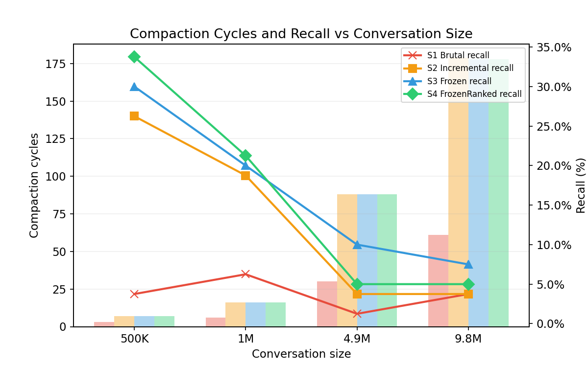
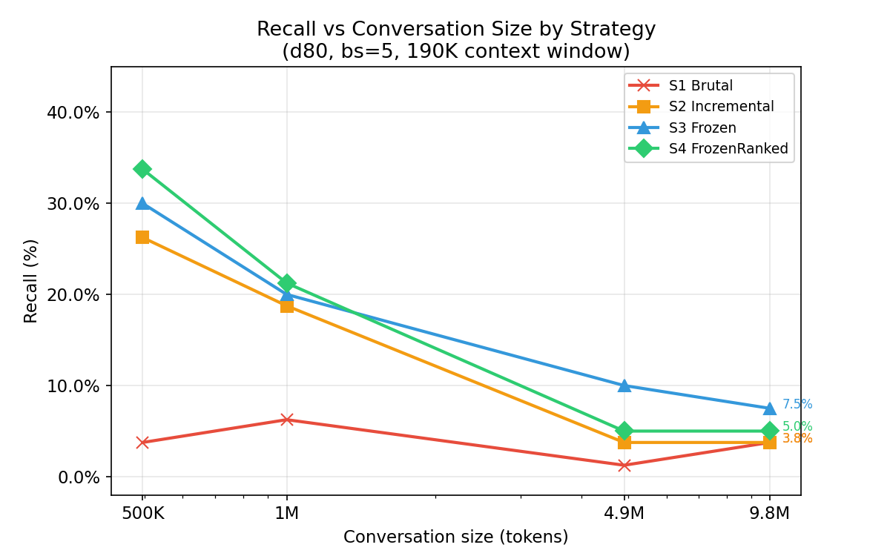
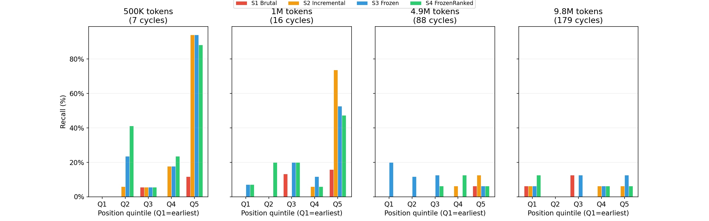
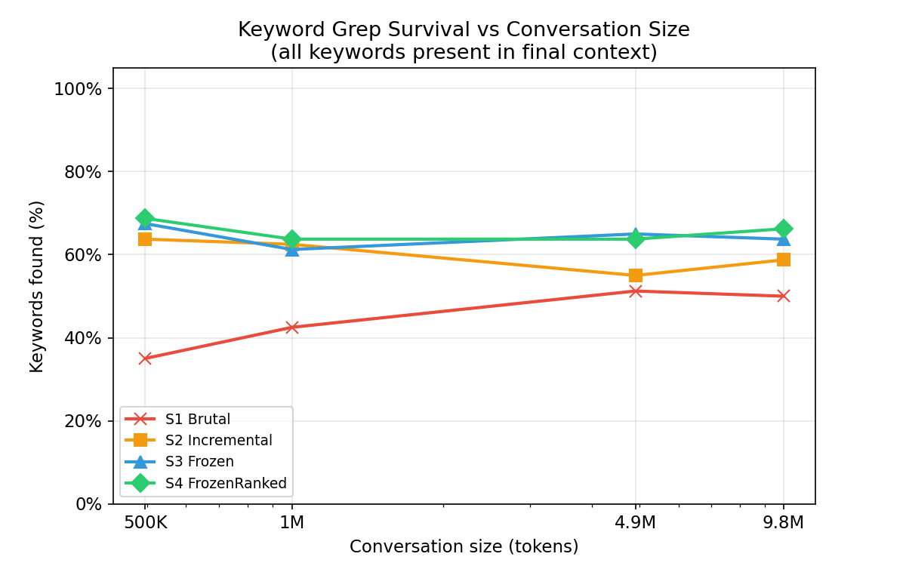
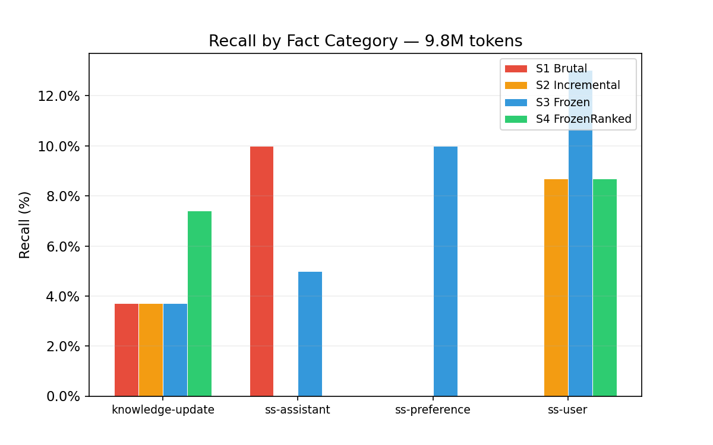
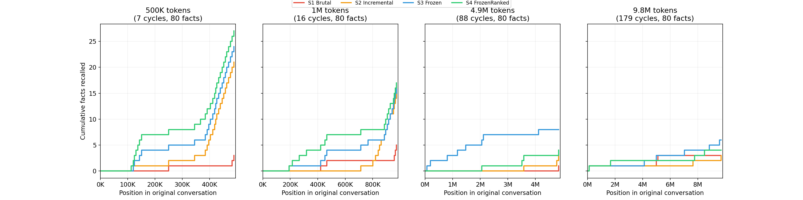
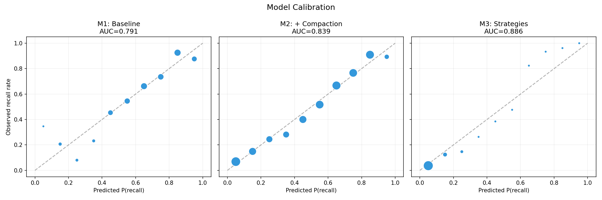
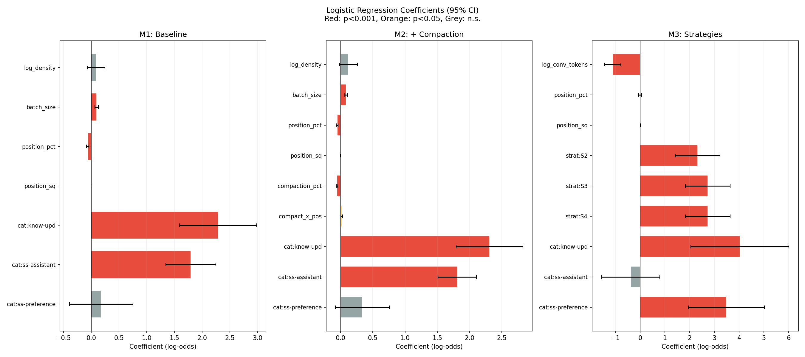
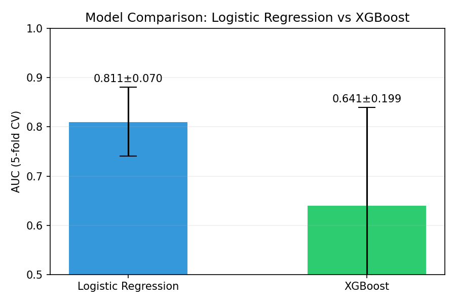

# Lost in Compaction: Measuring Information Loss in LLM Context Summaries

> Working paper — March 2026

## Abstract

Long-running LLM conversations inevitably exceed the context window, forcing
systems to compact old messages through summarization. But how do we know
whether our compaction benchmark accurately measures information loss? Before
comparing strategies, we need to understand how reliably an LLM can recall
facts from its own context — and what factors affect that recall.

We present a three-phase study. First, we **calibrate a recall benchmark**
using 234 naturally-embedded facts from the LongMemEval dataset across a
190K-token context. We discover four measurement pitfalls that affect all
compaction benchmarks: (1) a **questions-per-prompt effect** where Q=10 yields
11pp higher recall than Q=1 in static contexts — but the effect **reverses**
under severe compaction, with Q=1 outperforming Q=5 by 9pp,
(2) a **category hierarchy** where temporal reasoning (30% max) and preference
recall (40% max) are near-impossible regardless of strategy, (3) a **density
saturation** where recall plateaus beyond ~0.4 facts/kTok despite increasing
evidence, and (4) a **grep-LLM gap** where keyword search finds 86% of facts
but the LLM only recalls 25–79% of them — information is *present* in the
context but *ignored* by attention.

Second, we **isolate compaction loss** by compacting 5–98% of a context,
re-padding to the original size, and measuring recall degradation. Even 5%
compaction costs 7 percentage points of recall. At 50%, the compacted zone is
near-dead (0–7% recall) despite keywords surviving at 82–93% via grep.
Critically, compaction damages even the *untouched* portion of the context:
remaining-zone recall drops from 68% to 39% as compaction increases — an
**attention dilution** effect caused by injecting noise (re-padding) into the
context. Cross-model validation with Claude Sonnet 4.6 (92.5% baseline recall,
no Lost-in-the-Middle effect) confirms that severe compaction destroys
information regardless of model capability: even a model with flat spatial
recall drops to 21% at 98% compaction.

Third, we **compare four multi-pass compaction strategies** (Brutal,
Incremental, Frozen, FrozenRanked) on conversations ranging from 500K to 10M
tokens. The strategy hierarchy is consistent — Frozen > Incremental > Brutal
— but all strategies degrade severely with scale. FrozenRanked's hierarchical
merge provides only marginal gains over Frozen, suggesting that the bottleneck
is attention capacity, not compression quality.


## 1. Introduction

### 1.1 The problem

Stateless LLM APIs require the full conversation to be sent at each turn. When
conversations exceed the context window (typically 128K–200K tokens), some form
of compaction is necessary. The naive approach — summarize and discard old
messages — is universally adopted by production systems (Claude Code, Cursor,
Windsurf, MemGPT/Letta). But how much information survives this process?

Answering this question requires a reliable measurement tool. Most existing
benchmarks treat recall measurement as straightforward: embed facts, ask
questions, count correct answers. We found that the measurement itself is
surprisingly fragile — sensitive to how many questions are asked at once,
which categories of facts are tested, and whether "present in context" actually
means "retrievable by the model."

This led us to a three-phase approach: first calibrate the recall benchmark
(§3), then use it to measure single-pass compaction loss (§4–5), then compare
multi-pass strategies at scale (§6). The calibration itself yielded findings
that challenge common assumptions about LLM recall.

### 1.2 Related work

**Needle in a Haystack** (Kamradt, 2023). The foundational test for long-context
retrieval: embed a specific fact in a long document and measure whether the
model can find it. Tests the model's *native* retrieval ability within a single
context window. Our work extends this paradigm to measure fact *survival*
across compaction cycles — "Needle in a Compacted Haystack."

**LongMemEval** (Wang et al., 2025). Benchmarks long-term memory capabilities
of LLM systems across 500 questions in 6 categories (knowledge update, temporal
reasoning, multi-session, preferences, etc.) spanning up to 115 sessions. We
use LongMemEval evidence as our fact source, providing ecologically valid,
naturally-embedded facts rather than synthetic injections.

**Context Rot** (Chroma Research, 2025). Demonstrates that LLM performance
degrades systematically as input length increases, even on trivially simple
tasks. Evaluates 18 models and recommends compaction/summarization as
mitigation, but does not compare compaction strategies against each other
or measure information loss across strategies.

**MemGPT / Letta** (Packer et al., 2023). Proposes virtual context management
inspired by OS memory hierarchies: main context (RAM) and external context
(disk). When context overflows, messages are evicted and recursively
summarized — functionally identical to our incremental strategy. The paper
notes that "older messages have progressively less influence on the summary"
but does not benchmark this degradation or compare alternative strategies.

**Factory.ai — Evaluating Context Compression** (2025). The closest work to
ours. Compares three compression *implementations* (Factory's anchored
iterative, OpenAI Compact, Anthropic SDK) using probe-based evaluation
(recall, artifact, continuation, decision probes) on 36,000 production
messages. Key differences with our work:
- Factory compares *implementations* from different vendors; we compare
  fundamentally different *architectures* (single-shot vs iterative vs frozen)
- No zone-based recall metrics — their evaluation does not reveal where
  in the conversation information is lost
- No frozen summary strategy or space-time tradeoff analysis
- No calibration of the recall measurement itself

**Beyond a Million Tokens** (2025). Benchmarks long-term memory up to 10M
tokens across diverse domains, testing recall, multi-hop reasoning,
contradiction resolution, and temporal ordering. Tests model *capabilities*
at various context lengths, not compaction *strategy* effectiveness.

**Anthropic — Effective Context Engineering** (2025). Engineering guide
describing best practices for context management in AI agents, including
structured summarization and context pruning. Practical guidance but no
comparative benchmarking of strategies.

**Prompt Compression** (LLMLingua, Microsoft Research, 2024). Achieves up to
20x token compression with ~1.5% performance loss. Focuses on *prompt-level*
compression (removing redundant tokens), orthogonal to *conversation-level*
compaction (summarizing message history).

### 1.3 Gap in existing work

No prior work addresses the **measurement reliability** of compaction
benchmarks. Existing evaluations assume that embedding a fact and asking about
it provides a clean signal — we show this assumption is wrong.

Beyond measurement, no prior work compares fundamentally different compaction
*architectures* (single-shot vs iterative vs frozen summaries) on the same
conversation with spatial recall metrics. Existing benchmarks either test model
capabilities (Needle in a Haystack, Beyond a Million Tokens), measure context
rot without compaction (Chroma), or compare vendor implementations without
varying the underlying strategy (Factory.ai).

The re-summarization cascade problem ("JPEG cascade") is acknowledged
implicitly in MemGPT but never quantified. The frozen summary strategy and
the resulting space-time tradeoff have not been explored.

### 1.4 Contributions

We introduce:

1. **Evidence that recall measurement is non-trivial**: a significant questions-per-prompt
   effect (up to 20pp between Q=1 and Q=10) that **reverses direction** under severe
   compaction, a category-dependent recall hierarchy, and a systematic gap between
   keyword presence and LLM retrieval
2. **A calibrated benchmark protocol** using LongMemEval evidence with
   controlled density, factorial evidence design, and repeatability validation
3. **Controlled single-pass compaction loss measurement** isolating information
   destruction from context size reduction via re-padding
4. **The attention dilution effect**: compaction degrades recall even in
   untouched portions of the context
5. **The grep-LLM gap**: keywords survive compaction (82–93% grep recall)
   but the LLM fails to retrieve them (0–7% recall) — a "Lost in the Middle"
   amplification effect
6. **Multi-pass strategy comparison** across conversation sizes (500K–10M
   tokens) showing that architectural optimization yields diminishing returns
   against the attention bottleneck


## 2. Evidence and Evaluation Framework

### 2.1 Evidence source: LongMemEval

Rather than generating synthetic facts (as in our preliminary experiments),
we use evidence from the LongMemEval benchmark (Wang et al., 2025). LongMemEval
provides 500 question-answer pairs across 6 categories, each grounded in
realistic multi-session conversations between a user and an LLM assistant.

Each fact consists of:
- A **conversation excerpt** (the "evidence") containing the information
- A **question** that can only be answered from the evidence
- An **expected answer** with keywords for automated verification
- A **category** (knowledge-update, single-session-user, single-session-assistant,
  single-session-preference, temporal-reasoning, multi-session)

This provides ecologically valid facts — they are naturally embedded in
conversation, not injected as artificial needles.

### 2.2 Factorial evidence design (2×2)

We vary two dimensions of evidence preparation:

**Filtering** (complete vs filtered):
- *Complete*: all 500 questions included
- *Filtered*: only 234 questions from answerable categories (single-session-user,
  single-session-assistant, knowledge-update, single-session-preference).
  Excludes temporal-reasoning and multi-session, which require capabilities
  beyond single-context recall.

**Truncation** (full vs chopped):
- *Full*: evidence messages preserved in their entirety
- *Chopped*: messages truncated to realistic lengths (simulating context limits
  in real systems)

This yields four experimental modes:

| Mode | Filtering | Truncation | Questions | Max density (facts/kTok) |
|------|-----------|------------|:---------:|:------------------------:|
| R1   | Complete  | Full       | 500       | 0.10                     |
| R2   | Complete  | Chopped    | 500       | 0.42                     |
| R3   | Filtered  | Full       | 234       | 0.16                     |
| R4   | Filtered  | Chopped    | 234       | 0.79                     |

### 2.3 Context construction

For a given density δ, we embed N = δ × L evidence items into a context of
L kilotokens (190 kTok for calibration and single-pass experiments). Evidence
items are placed at uniformly distributed positions. The remaining space is
filled with realistic padding — real LLM conversation sessions from the
LongMemEval pool (18,255 sessions available) — maintaining ecological
validity rather than using synthetic filler.

Context construction is deterministic (seed=42), ensuring reproducibility
across runs. The padding pool provides ~46M tokens of real conversations.

### 2.4 Density sweep

We define **fact density** δ = N/L, where N is the number of embedded facts
and L the context size in kilotokens (kTok). Rather than testing a single
density, we sweep across values:

| N (facts) | Context | δ (facts/kTok) |
|:---------:|:-------:|:--------------:|
| 4 | 190 kTok | 0.02 |
| 10 | 190 kTok | 0.05 |
| 20 | 190 kTok | 0.11 |
| 40 | 190 kTok | 0.21 |
| 60 | 190 kTok | 0.32 |
| 80 | 190 kTok | 0.42 |
| 150 | 190 kTok | 0.79 |

This reveals saturation effects: at what density does the model's recall
capacity plateau? The scripts use shorthand `dN` (e.g., `d80` = 80 facts in
190 kTok = δ 0.42); in the text, we report density as δ.

### 2.5 Evaluation protocol

**Q&A phase**: For each fact, the LLM (Claude Haiku 4.5) is presented with
the full context as conversation history and asked to recall the specific
information. Multiple questions can be asked in a single prompt; we denote
Q the number of **questions per prompt** and test Q=1, Q=5, and Q=10.

**Judge phase**: A separate LLM judge compares the model's answer against the
expected answer keywords. Binary recall (correct/incorrect) and accuracy
(correct and precisely matching) are computed.

**Grep validation**: As a free upper bound, we check whether fact keywords
appear verbatim in the context. If grep doesn't find them, the LLM cannot
possibly recall them. The gap between grep recall and LLM recall quantifies
the "present but ignored" phenomenon.

Both Q&A and judge phases use Claude Haiku 4.5 via the Anthropic Batch API.

### 2.6 Repeatability

All key results are validated with 3 independent runs. We report mean ± σ.
For the single-pass compaction experiment (§5), 3 runs at δ=0.42/Q=5 yield σ ≤ 2.6pp
across all compaction levels, confirming that observed effects (7–70pp) are
far larger than measurement noise.


## 3. Recall Calibration Results

### 3.1 The questions-per-prompt effect

The most surprising finding: asking more questions at once dramatically
improves recall.


*Figure 1: Recall as a function of fact density (facts/kTok) for three values of Q.
The secondary axis maps density values to the d** notation used throughout the paper.
Grep upper bound (dashed) shows near-perfect keyword presence regardless of density.*

At δ=0.42 (80 facts in 190 kTok, R4 mode), recall ranges from 67.5% (Q=1) to 78.8% (Q=10) — an
11pp gap on the same context with the same facts. At higher densities (δ=0.63),
the gap reaches 20pp. Critically, this effect **reverses** under severe
compaction (§5.6): at C4 (98% compacted), Q=1 outperforms Q=5 by 9pp, as
focused single-question attention outperforms multi-query probing in degraded contexts.

**Why this matters for benchmarks**: Any compaction evaluation that uses a
fixed Q is measuring a confound of retrieval ability and multi-query
prompting. Results from different values of Q are not directly comparable.
Our preliminary experiments used Q=10 exclusively — this produced
inflated baselines that masked the true difficulty of recall.

**Mechanism hypothesis**: Multiple questions in a single prompt create
implicit cross-references that help the model locate relevant information.
A question about "Rachel's new city" might prime attention for nearby facts
about "family trip" or "moving costs," improving recall for co-located facts.

### 3.2 Category hierarchy

Not all facts are equally recallable. We identify a clear hierarchy:


*Figure 2: Recall breakdown by fact category at δ=0.42 (80 facts), for three values of Q.
User statements and assistant responses are reliably recalled (85–100%),
while preferences remain fragile (20–40%) regardless of Q.*

| Category                  | Recall range (Q=5) | Notes                |
|---------------------------|:-------------------:|----------------------|
| single-session-user       | 80–100%             | User's own statements, easiest |
| single-session-assistant  | 80–100%             | Assistant's responses |
| knowledge-update          | 60–65%              | Updated information, stable |
| single-session-preference | 20–40%              | User preferences, fragile |
| temporal-reasoning        | max 30%             | Requires inference, near-impossible |
| multi-session             | max 42%             | Cross-session facts, very hard |

The top two categories (user/assistant statements) are near-ceiling. Knowledge
updates plateau at ~60%. Preferences are fragile — the model struggles with
"What is my favorite X?" even when the information is present. Temporal
reasoning and multi-session facts are effectively unmeasurable in a single
context.

**Implication for compaction benchmarks**: Testing on "easy" categories
(single-session) inflates recall and masks real degradation. Testing on "hard"
categories (temporal, multi-session) produces floor effects that make strategies
indistinguishable. The filtered mode (R3/R4) excludes impossible categories
while retaining a mix of easy and hard categories.

### 3.3 The grep-LLM gap: present but ignored

For every fact, we check whether its keywords appear in the context via grep.
Grep recall at δ=0.42 is 86%. But LLM recall at Q=1 is only 67.5%.

This 19pp gap — facts that are *verifiably present* in the context but
*not retrieved* by the model — is a direct measurement of the "Lost in the
Middle" phenomenon (Liu et al., 2023) in a realistic conversational setting.

The gap is not uniform across the context: facts in the middle of a 190K
context are more likely to be present-but-ignored than facts near the
beginning or end.

### 3.4 Factorial analysis: filtering vs truncation

The 2×2 factorial design reveals two independent effects:

| Effect      | Magnitude | Mechanism |
|-------------|:---------:|-----------|
| Filtering   | +14–15pp  | Excludes impossible questions, consistent across truncation |
| Truncation  | -13–22pp  | Removes information from evidence messages |
| Composition | +2.5pp    | Removing hard-category evidence barely helps easy-category recall |

The **filtering effect** is remarkably consistent (+14pp and +15pp across
truncation conditions). This means it's driven entirely by excluding
impossible questions, not by freeing context space.

The **composition effect** is near-zero (+2.5pp mean): whether hard-category
evidence occupies context space alongside easy-category facts makes almost
no difference to easy-category recall. This validates using unfiltered
evidence as realistic padding in controlled experiments.


## 4. Controlled Compaction Experiment

### 4.1 Design

This experiment isolates the information loss from compaction itself,
independent of context size reduction. The protocol:

1. Start with a calibrated 190K context (from the recall calibration, mode R4)
2. Compact the oldest X% of messages using LLM summarization
3. **Re-pad** to the original 190K size with real conversation sessions
4. Measure recall on the same facts

The re-padding step is critical: it keeps context size constant, so any recall
degradation is attributable to compaction, not to having less context.

### 4.2 Compaction levels

| Level | % compacted | What happens |
|-------|:-----------:|--------------|
| C0    | 0%          | Baseline (no compaction) |
| C1    | 5%          | Minimal compaction (oldest ~36 messages) |
| C2    | 25%         | Moderate (oldest quarter) |
| C3    | 50%         | Half the context compacted |
| C4    | 98%         | Nearly everything compacted (all except last user/assistant exchange) |

For each level, we track which facts fall in the compacted zone vs the
remaining zone, enabling spatial analysis of information loss.

### 4.3 Compaction method

We use single-pass LLM summarization (Claude Haiku 4.5): the oldest X% of
messages is concatenated and sent to the model with instructions to produce
a concise summary. The summary replaces the original messages, freeing
space that is then filled with padding sessions.

The compaction prompt emphasizes preserving factual details, technical
specifications, and decisions — the same prompt used in production compaction
systems.

[Note: §6 compares different multi-pass strategies: Brutal, Incremental,
Frozen, and FrozenRanked. This section uses single-pass to isolate the
fundamental compaction loss before strategy effects compound.]


## 5. Single-Pass Compaction Results

### 5.1 Recall degradation is monotone and severe


*Figure 3: Recall degradation by compaction percentage at Q=5, for three densities.
All curves decline monotonically. The grep upper bound at δ=0.42 (dashed) stays above 80%
even at C4, illustrating the grep-LLM divergence.*

Recall degrades monotonically with compaction percentage:

| Level   | δ=0.21 (Q=10) | δ=0.32 (Q=10) | δ=0.42 (Q=10) |
|---------|:-----------:|:-----------:|:-----------:|
| C0      | 62.5%       | 75.0%       | 78.8%       |
| C1 (5%) | 55.0% (-7)  | 68.3% (-7)  | 72.5% (-6)  |
| C2 (25%)| 40.0% (-23) | 50.0% (-25) | 58.8% (-20) |
| C3 (50%)| 25.0% (-38) | 33.3% (-42) | 43.8% (-35) |
| C4 (98%)| 2.5% (-60)  | 10.0% (-65) | 7.5% (-71)  |

Even the lightest compaction (C1, 5%) costs 6–7 percentage points. At C4
(98%), recall drops to single digits — the conversation is effectively
destroyed.

The degradation is consistent across densities: higher-density contexts
have more room to fall but the relative pattern is identical.

### 5.2 The compacted zone is dead

Facts within the compacted region are almost never recalled, even though
their keywords survive in the summary:

| Level | Grep survival (compacted zone) | LLM recall (compacted zone) |
|-------|:------------------------------:|:---------------------------:|
| C1    | 50% (n=2)                      | 0%                          |
| C2    | 82–91%                         | 8–18%                       |
| C3    | 83–93%                         | 0–7%                        |
| C4    | 59–62%                         | 2–4%                        |

This is the most striking result: **grep finds the keywords in the summary,
but the LLM cannot use them to answer questions.** The summary preserves
lexical traces of the facts but destroys the surrounding context that would
enable retrieval. This is the "Lost in the Middle" effect amplified: the
summary sits at the very beginning of the context — the least-attended
position after the primacy window is exhausted.

### 5.3 Attention dilution: compaction damages untouched facts

The remaining zone (facts that were *not* compacted, sitting in their original
messages) also loses recall as compaction increases:

| Level | Remaining zone recall (δ=0.42, Q=5) | n_facts |
|-------|:---------------------------------:|:-------:|
| C1    | 73%                               | 78      |
| C2    | 59%                               | 69      |
| C3    | 53%                               | 59      |
| C4    | 80%                               | 5       |

From C1 to C3, remaining-zone recall drops from 73% to 53% — a 20pp loss on
facts that were never touched by compaction. The mechanism: re-padding replaces
the compacted portion with noise (unrelated conversation sessions). This noise
dilutes the model's attention, degrading retrieval even for intact facts.

C4 is an outlier (80%) because only 5 facts remain in the zone — too few for
statistical reliability, but consistent with the model finding a needle among
mostly-padding.

### 5.4 Spatial recall density


*Figure 4: Cumulative recalled facts by position in the original 190K context (δ=0.42, Q=5).
Each step curve shows one compaction level. Dotted vertical lines mark compaction boundaries.
The C0 baseline exhibits the classic "lost in middle" profile — flat through the central region,
steep at the end (recency). Compacted variants (C3, C4) concentrate their recall
in the surviving portion but lose most facts from the compacted zone.*

This visualization maps each fact to its position in the original (pre-compaction)
context and shows whether it was recalled. It reveals:

- **C0**: Relatively uniform recall across the context, with slight primacy
  and recency effects
- **C1**: A small shadow at the beginning (compacted zone), rest intact
- **C2**: A larger shadow covering the first 25% of the context
- **C3**: The first half is dead, the second half is weakened by attention dilution
- **C4**: Almost complete darkness, with tiny islands of recall at the very end

This provides a visual "damage map" showing exactly where compaction destroys
information.

### 5.5 Repeatability

Three independent runs at δ=0.42/Q=5 (the most demanding configuration with
80 facts) confirm stability:

| Level | Run 1  | Run 2  | Run 3  | Mean    | σ     |
|-------|:------:|:------:|:------:|:-------:|:-----:|
| C0    | 73.8%  | 78.8%  | 77.5%  | 76.7%   | ±2.6  |
| C1    | 71.2%  | 68.8%  | 68.8%  | 69.6%   | ±1.4  |
| C2    | 52.5%  | 53.8%  | 52.5%  | 52.9%   | ±0.7  |
| C3    | 40.0%  | 40.0%  | 40.0%  | 40.0%   | ±0.0  |
| C4    | 8.8%   | 6.2%   | 6.2%   | 7.1%    | ±1.5  |

Maximum variance is ±2.6pp (C0 baseline). All compaction effects (−7pp to
−70pp) are far larger than measurement noise. The C3 result is remarkably
stable (40.0% in all three runs), suggesting that at this compaction level,
the outcome is nearly deterministic.

### 5.6 Q-effect inversion under compaction

The calibration (§3) established that asking more questions per prompt yields
higher recall in static contexts: at δ=0.42, Q=10 reaches 79% vs 68% for Q=1.
This holds for uncompacted and lightly compacted contexts. However, under
severe compaction, the effect **reverses**:

| Level | Q=5 | Q=1 | Δ (Q=1 − Q=5) |
|-------|:---:|:---:|:-------------:|
| C0    | 73.8% | 67.5% | −6.3pp |
| C1 (5%)  | 66.2% | 55.0% | −11.2pp |
| C2 (25%) | 50.0% | 47.5% | −2.5pp |
| C3 (50%) | 35.0% | 31.2% | −3.8pp |
| C4 (98%) | 2.5%  | 11.2% | **+8.7pp** |

At C4, Q=1 surpasses Q=5 by 8.7pp. The same inversion appears in
the iterative multi-pass experiments (§6): across all four strategies at 1M
tokens, Q=1 outperforms Q=5 by 5–9pp.

The mechanism is intuitive: in a rich context, multiple questions per prompt
cast a wider net, increasing the chance of activating diverse regions. In a
degraded context (heavy compaction or many compaction cycles), the model's
limited attention is better spent focusing on a single question rather than
splitting across multiple retrieval targets.

This has practical implications for benchmarking: **Q=5 results are not
directly comparable to Q=1 results**, and the direction of the bias depends
on context quality. Evaluations of compacted contexts should report results
at multiple Q values or, at minimum, note which Q was used.

### 5.7 Cross-model validation: Sonnet 4.6

To test whether our findings are model-specific, we replicated the
single-pass compaction experiment using Claude Sonnet 4.6 (Q=1, δ=0.42,
judge: Haiku 4.5).

| Level | Haiku 4.5 | Sonnet 4.6 | Haiku Δ/C0 | Sonnet Δ/C0 |
|-------|:---------:|:----------:|:----------:|:-----------:|
| C0    | 67.5%     | 92.5%      | —          | —           |
| C1 (5%)  | 55.0%  | 90.0%      | −12.5pp    | −2.5pp      |
| C2 (25%) | 47.5%  | 86.2%      | −20.0pp    | −6.2pp      |
| C3 (50%) | 31.2%  | 62.5%      | −36.2pp    | −30.0pp     |
| C4 (98%) | 11.2%  | 21.2%      | −56.2pp    | −71.2pp     |

Three key findings emerge:

**1. Sonnet has no Lost-in-the-Middle effect.** The C0 spatial recall profile
is flat: 93% early, 93% mid, 92% late. Haiku's C0 shows the classic U-shaped
profile (higher at extremes, lower in the middle). This difference disappears
under compaction — both models converge to similar spatial patterns at C3–C4.


*Figure 8: Smoothed recall density by position in the original context (Gaussian
kernel, bw=15kTok). Left: Haiku Q=5. Center: Haiku Q=1. Right: Sonnet Q=1.
Sonnet's C0 (green) is flat at ~95%, confirming the absence of Lost-in-the-Middle.
Under compaction, all models show the same pattern: dead zone in the compacted
region, concentration of recall at the context end.*

**2. A stronger model resists light compaction better.** Sonnet loses only
2.5pp at C1 and 6.2pp at C2, vs 12.5pp and 20.0pp for Haiku. The additional
25pp of baseline recall provides a buffer against moderate information loss.

**3. Severe compaction equalizes models.** At C3–C4, the delta relative to C0
is similar (−30pp and −71pp for Sonnet vs −36pp and −56pp for Haiku). This
confirms that the information is **destroyed by the compaction process itself**,
not merely hidden from a weaker model's attention. If the degradation were
purely attentional, Sonnet's superior baseline should provide proportional
protection at all compaction levels.

This cross-model comparison strengthens the paper's central finding: the
bottleneck at high compaction is information destruction, not attention
capacity.


## 6. Strategy Comparison at Scale

The calibration (§3) and single-pass experiments (§5) established *how* recall
works and *what* compaction destroys. This section addresses the core question:
when compaction must be applied
repeatedly over a long conversation, **which strategy preserves the most
information?**

### 6.1 Strategies under evaluation

**Brutal (single-shot)**: When context exceeds 90% of max, summarize ALL
messages except the 2 most recent. The input is truncated to a character cap
(~150K real tokens) before summarization.

```
═══════════════════════════════════════════════════════════════════
 BRUTAL
═══════════════════════════════════════════════════════════════════

  BEFORE (at 90%)                    AFTER compact

 200K ┌───────────────────┐  100%   200K ┌───────────────────┐  100%
      │                   │              │                   │
 180K ╞═══ HIGH WM (90%)══╡  ─┐    180K ╞═══ HIGH WM (90%)══╡
      │                   │   │         │                   │
      │  Recent messages  │   │         │                   │
      │                   │   │         │                   │
      │  Raw messages     │   │         │                   │
      │  ~180K tokens     │   │         │    (empty)        │
      │                   │   │         │                   │
      │  Old messages     │   │         │                   │
      │                   │   │         │                   │
 120K ╞═══ LOW WM (60%) ══╡   │    120K ╞═══ LOW WM (60%) ══╡
      │                   │   │         │                   │
      │  Oldest messages  │   │         │                   │
      │                   │   │         │  Last 2 msgs      │
      │                   │   │         │  ~200 tokens      │
   0K └───────────────────┘   0%     0K ├───────────────────┤
                              │         │  Summary (N)      │
                  Summarize ALL ──────► │  ~500 tokens      │
                  (truncate at cap)     └───────────────────┘
```

**Incremental (dual watermark)**: When context exceeds 90%, compact enough old
messages to bring context down to 60%. Previous summaries ARE included in the
text to be re-summarized. Creates a "JPEG cascade" where each cycle degrades
earlier summaries.

```
═══════════════════════════════════════════════════════════════════
 INCREMENTAL
═══════════════════════════════════════════════════════════════════

  BEFORE (at 90%)                    AFTER compact

 200K ┌───────────────────┐  100%   200K ┌───────────────────┐  100%
      │                   │              │                   │
 180K ╞═══ HIGH WM (90%)══╡         180K ╞═══ HIGH WM (90%)══╡
      │                   │              │                   │
      │  Recent messages  │              │                   │
      │  (not compacted)  │              │    (empty)        │
      │                   │              │                   │
 120K ╞═══ LOW WM (60%) ══╡         120K ╞═══ LOW WM (60%) ══╡
      │                   │              │                   │
      │  Raw messages     │    ────────► │  Recent messages  │
      │                   │              │  (kept as-is)     │
      ├───────────────────┤              │  ~118K tokens     │
      │  Summary v.(N-1)  │              ├───────────────────┤
      │  ~2K tokens       │ ───────────► │  Summary v.N      │
   0K └───────────────────┘              │  re-summarized!   │
                                         └───────────────────┘

      Problem: summary v.N = summary of a summary of a summary...
```

**Frozen (dual watermark + immutable summaries)**: Same trigger and target as
incremental, but completed summaries are marked as frozen and never
re-summarized. Only raw (non-frozen) messages are compacted. When frozen
summaries exceed a budget, the oldest are merged.

```
═══════════════════════════════════════════════════════════════════
 FROZEN
═══════════════════════════════════════════════════════════════════

  BEFORE (at 90%)                    AFTER compact

 200K ┌───────────────────┐  100%   200K ┌───────────────────┐  100%
      │                   │              │                   │
 180K ╞═══ HIGH WM (90%)══╡         180K ╞═══ HIGH WM (90%)══╡
      │                   │              │                   │
      │  Recent messages  │              │    (empty)        │
      │  (not compacted)  │              │                   │
      │                   │         120K ╞═══ LOW WM (60%) ══╡
 120K ╞═══ LOW WM (60%) ══╡              │                   │
      │                   │              │  Recent messages  │
      │  Raw messages     │  ──────────► │  (kept as-is)     │
      │                   │              │  ~74K tokens      │
      ├───────────────────┤              ├───────────────────┤
      │  Frozen #(N-1)    │  untouched   │  NEW Frozen #N    │ ◄ new!
  60K ├╌╌╌ BUDGET (30%) ╌╌┤  ─────────►  ├───────────────────┤
      │  Frozen #2        │              │  Frozen #(N-1)    │
      │  Frozen #1        │              │  Frozen #2        │
   0K └───────────────────┘              │  Frozen #1        │
                                      0K └───────────────────┘

      Frozen summaries = never re-summarized.
      Tradeoff: they eat context space for recent messages.
```

**FrozenRanked (hierarchical merge)**: A variant of Frozen where each frozen
summary carries a *rank* (initially 1). When frozen summaries exceed their
budget, only two summaries of the *lowest available rank* merge — producing
a summary of rank+1. This limits each fact to at most log₂(N) compression
passes, compared to N/2 in Frozen's sequential oldest-first merging.

```
═══════════════════════════════════════════════════════════════════
 FROZEN RANKED — merge by rank
═══════════════════════════════════════════════════════════════════

  Frozen's merge strategy         FrozenRanked's merge strategy
  (sequential)                    (hierarchical by rank)

  ┌──────────┐                    ┌──────────┐
  │ Frozen#6 │ ◄ newest           │ Frozen#6 │ R1  ◄ newest
  │ Frozen#5 │                    │ Frozen#5 │ R1
  │ Frozen#4 │                    │ Frozen#4 │ R1
  │ Frozen#3 │                    │ Frozen#3 │ R2  (was R1+R1)
  │ Frozen#2 │                    │ Frozen#2 │ R2  (was R1+R1)
  │ Frozen#1 │ ◄ oldest           │ Frozen#1 │ R3  (was R2+R2)
  └──────────┘                    └──────────┘

  Budget exceeded → merge         Budget exceeded → merge
  Frozen#1 + Frozen#2             two lowest-rank: #5 + #6 (both R1)
  → always the oldest pair        → same-quality summaries merged

  After 10 merges:                After 10 merges:
  Frozen#1 has been merged        Frozen#1 has been merged
  into 5 times (N/2)              into 3 times (log₂N)
    ↓ severe degradation            ↓ moderate degradation
```

The key insight: in Frozen, the oldest summary accumulates *all* merges
sequentially (cascade). In FrozenRanked, merges are balanced like a
tournament bracket — summaries of similar compression depth merge together,
preventing any single summary from being re-compressed excessively.

### 6.2 Preliminary results

Our preliminary experiments used synthetic facts on 1.5M and 3M-token
conversations. While the evidence was less rigorous than §3–5 (synthetic
facts, no density calibration, Q=10 only), the structural findings are
informative:

| Strategy    | Global 1.5M | Global 3M | Early 1.5M | Early 3M | Profile |
|-------------|:-----------:|:---------:|:----------:|:--------:|---------|
| Brutal      | 12.7%       | 3.3%      | 2%         | 1%       | ▁▁█ present-biased |
| Incremental | 16.0%       | 3.7%      | 2%         | 2%       | ▁▃█ JPEG cascade |
| Frozen      | 16.0%       | 4.7%      | 26%        | 12%      | █▃▂ past-preserving |

Key observations:
- **Frozen preserves early facts** (26% vs 2% at 1.5M) by preventing
  re-summarization
- **JPEG cascade is real**: incremental's accuracy/recall ratio is only 46%
  (facts recalled in degraded form)
- **Rankings are stable across scales**: Frozen > Incremental > Brutal
- **All strategies degrade severely** at 3M (-71% to -77% relative drop)

These results motivated the calibrated experiments below, which confirm the
same hierarchy (Frozen > Incremental > Brutal) with rigorous evidence while
adding FrozenRanked and spatial analysis.

### 6.3 Protocol: iterative strategy comparison

Unlike the calibration and single-pass experiments (static 190K context), this protocol simulates a
**real long session**: messages are fed into the context window in batches of
10, and compaction triggers naturally when the high watermark (90%) is reached.
This produces the authentic compaction cascade that real users experience.

**Setup**: 80 facts (R4, δ=0.42 in the calibration context) uniformly interleaved in conversations of
increasing size (500K, 1M, 5M, 10M tokens). All four strategies share the
same conversation and facts for each size. Q&A evaluation with Q=5,
automated judge scoring.

**Metrics**: global recall, recall by position quintile (Q1=earliest facts
through Q5=latest), recall by compression depth (how many compaction cycles
a fact has survived), and keyword grep survival.


*Figure 5: Number of compaction cycles (bars) and recall (lines) by
conversation size. Cycles scale linearly with conversation length; recall
decays non-linearly, with most loss occurring in the first 10–20 cycles.*

### 6.4 Results: conversation size sweep

All sizes use the same 80 facts (N=80), yielding decreasing effective density:

| Conversation | Tokens | N | δ_eff (facts/kTok) |
|---|:---:|:---:|:---:|
| 500K | 496K | 80 | 0.16 |
| 1M | 984K | 80 | 0.08 |
| 5M | 4.9M | 80 | 0.016 |
| 10M | 9.8M | 80 | 0.008 |

This decreasing density is an acknowledged confound (see cross-size analysis below).


*Figure 6: Recall by strategy as conversation size increases from 500K to 10M
tokens. All strategies degrade, but Frozen (S3) shows the slowest decline.
The gap between strategies narrows at scale.*

The summary table below shows recall, grep survival, compaction cycles, and
recall by position quintile (Q1=earliest facts, Q5=latest) for each size:

#### 500K tokens (496K, 3–7 compaction cycles)

| Strategy | Recall | Grep | Cycles | Q1 | Q2 | Q3 | Q4 | Q5 |
|----------|:------:|:----:|:------:|:--:|:--:|:--:|:--:|:--:|
| S1 Brutal | 3.8% | 35.0% | 3 | 0% | 0% | 6% | 0% | 12% |
| S2 Incremental | 26.2% | 63.7% | 7 | 0% | 6% | 6% | 18% | 94% |
| S3 Frozen | 30.0% | 67.5% | 7 | 0% | 24% | 6% | 18% | 94% |
| S4 FrozenRanked | 33.8% | 68.8% | 7 | 0% | 41% | 6% | 24% | 88% |

At 500K (only 7 cycles), the hierarchy is clear: S1 << S2 < S3 ≤ S4.
S2 is heavily recency-biased (94% in Q5, near-zero elsewhere). S3 and S4
differ mainly in Q2 (24% vs 41%), confirming that freezing preserves
second-oldest facts. S3 and S4 are functionally identical at this scale
because 7 frozen summaries don't trigger merge pressure.

#### 1M tokens (984K, 6–16 compaction cycles)

| Strategy | Recall | Grep | Cycles | Q1 | Q2 | Q3 | Q4 | Q5 |
|----------|:------:|:----:|:------:|:--:|:--:|:--:|:--:|:--:|
| S1 Brutal | 6.2% | 42.5% | 6 | 0% | 0% | 13% | 0% | 16% |
| S2 Incremental | 18.8% | 62.5% | 16 | 0% | 0% | 0% | 6% | 74% |
| S3 Frozen | 20.0% | 61.3% | 16 | 7% | 0% | 20% | 12% | 53% |
| S4 FrozenRanked | 21.2% | 63.7% | 16 | 7% | 20% | 20% | 6% | 47% |

At 1M, all strategies degrade versus 500K. S2's recency bias persists (74%
in Q5) but its total recall drops from 26% to 19%. S3 and S4 show a more
distributed profile: S3 recalls facts in Q1 (7%), Q3 (20%), and Q5 (53%),
while S4 adds Q2 (20%). The S3–S4 gap narrows to 1.2pp — 16 frozen
summaries still don't exceed the merge budget.

#### 5M tokens (4.9M, 30–88 compaction cycles)

| Strategy | Recall | Grep | Cycles | Q1 | Q2 | Q3 | Q4 | Q5 |
|----------|:------:|:----:|:------:|:--:|:--:|:--:|:--:|:--:|
| S1 Brutal | 1.2% | 51.2% | 30 | 0% | 0% | 0% | 0% | 6% |
| S2 Incremental | 3.8% | 55.0% | 88 | 0% | 0% | 0% | 6% | 13% |
| S3 Frozen | 10.0% | 65.0% | 88 | 20% | 12% | 13% | 0% | 6% |
| S4 FrozenRanked | 5.0% | 63.7% | 88 | 0% | 0% | 6% | 13% | 6% |

At 5M, the most striking result is S3's **inverted quintile profile**: the
earliest facts (Q1=20%) are recalled *better* than the latest (Q5=6%).
This is the frozen summary strategy working as designed — early summaries
are preserved immutably while recent messages are repeatedly overwritten by
new content. S2, by contrast, shows the opposite: only the latest quintile
survives (Q5=13%), consistent with its JPEG cascade destroying older content.

S4 (5.0%) performs worse than S3 (10.0%) at this scale. This is likely
statistical variance (4 vs 8 recalled facts out of 80) rather than a
systematic effect, since **no merges were triggered**: 88 frozen summaries
occupy only ~37K tokens, well below the 57K merge budget
(190K × 0.60 × 0.50). S3 and S4 are structurally identical at 5M —
their difference is noise.

#### 10M tokens (9.8M, 61–179 compaction cycles)

| Strategy | Recall | Grep | Cycles | Q1 | Q2 | Q3 | Q4 | Q5 |
|----------|:------:|:----:|:------:|:--:|:--:|:--:|:--:|:--:|
| S1 Brutal | 3.8% | 50.0% | 61 | 6% | 0% | 13% | 0% | 0% |
| S2 Incremental | 3.8% | 58.8% | 179 | 6% | 0% | 0% | 6% | 6% |
| S3 Frozen | 7.5% | 63.8% | 178 | 6% | 0% | 13% | 6% | 13% |
| S4 FrozenRanked | 5.0% | 66.3% | 178 | 13% | 0% | 0% | 6% | 6% |

At 10M, the most significant result is **S2's convergence to S1**: both at
3.8% recall. After 179 compaction cycles, Incremental's JPEG cascade has
completely destroyed its content — the strategy that preserves "recent"
information has nothing left when "recent" means 179 re-compressions deep.
This is the terminal state of the cascade.

S3 Frozen retains the lead at 7.5% (6/80 facts), roughly double the others.
Its quintile profile remains distributed (Q1=6%, Q3=13%, Q5=13%), confirming
that frozen summaries continue to preserve facts across the full conversation
span even at extreme scale.

S4 FrozenRanked (5.0%) again underperforms S3. Critically, **no merges
were triggered even at 10M tokens**: all 178 frozen summaries have
`compression_depth=1`. At ~420 tokens each, 178 summaries occupy ~75K tokens —
still below the merge budget (190K × 0.60 × 0.50 = 57K). This means the
frozen zone simply grows without consolidation, and the theoretical
logarithmic advantage of FrozenRanked never materializes. The merge budget
formula may need recalibration for conversations of this length.


*Figure 7: Recall by position quintile across conversation sizes. S2 (Incremental)
is uniformly recency-biased at short scales but collapses entirely at 10M.
S3 (Frozen) maintains a distributed profile throughout.*

#### Cross-size analysis


*Figure 8: Grep keyword survival by strategy. All strategies maintain 50–66%
keyword presence even at 10M tokens, despite recall dropping to 3.8–7.5%.
The grep-LLM gap widens catastrophically with scale.*

Four patterns emerge across the full size sweep:

**1. Universal degradation.** Every strategy loses recall as conversation
size increases. From 500K to 10M: S1 stays flat at 1–6%, S2 collapses from
26.2% to 3.8%, S3 from 30.0% to 7.5%. No strategy is immune to scale.

**2. Grep diverges from recall.** Keyword survival (grep) remains relatively
stable (50–66% across sizes and strategies) while LLM recall plummets. At
10M, S3 retains 64% of keywords but only 7.5% recall — a 56pp gap. This
confirms the single-pass finding (§5.2) at iterative scale: information
presence does not equal retrievability.

**3. S2 converges to S1.** The defining result at 10M: Incremental compaction,
after enough cycles, becomes indistinguishable from Brutal. The JPEG cascade
is not merely degrading — it has a terminal state equivalent to full destruction.

**4. S3 retains a 2× advantage.** Frozen consistently outperforms all other
strategies, maintaining roughly double the recall of the next best option.
But even S3's ceiling drops from 30% (500K) to 7.5% (10M). The S3–S4 gap
remains negligible (0–5pp) throughout because no merges are triggered,
making the strategies structurally identical.


*Figure 9: Recall by fact category at the largest conversation size. All
categories collapse to near-zero for most strategies.*

**Density confound.** All conversation sizes use the same 80 facts, resulting
in decreasing fact density as conversations grow (0.16 facts/kTok at 500K
to 0.008 at 10M — a 20× reduction). The recall degradation observed above
therefore conflates two effects: increased compaction cycles and decreased
fact density. The predictive model (§7) shows that `log_density` is not
independently significant once other factors are controlled (p=0.08–0.26),
suggesting that compaction cycles are the dominant driver. Nevertheless,
a constant-density nested design would more cleanly isolate this effect.

#### Spatial recall: where are facts recovered from?


*Figure 10: Cumulative recalled facts by position in the original conversation,
one panel per size. Each step represents one recalled fact. Incremental (S2,
orange) recalls almost exclusively from the final portion — pure recency bias.
Frozen (S3, blue) accumulates recalls from the first half of the conversation
at 5M, demonstrating that frozen summaries preserve early information.*

This visualization is the multi-pass counterpart to Figure 4 (single-pass spatial
density). It maps each fact to its position in the *original* pre-compaction
conversation and shows whether it was recalled after compaction.

At 500K, all strategies except S1 show a recency ramp — S3/S4 add earlier
steps from frozen summaries. At 1M, the separation sharpens: S2 remains
flat until the last 200K tokens, while S3/S4 show progressive accumulation
starting from the first third.

At 5M, the pattern inverts for S3: all 8 recalled facts come from the
**first half** of the conversation. The frozen summaries, created during the
first 44 compaction cycles, are the sole surviving evidence from that era.
Recent messages, overwritten by subsequent compaction cycles, contribute
nothing. S2 (3 facts) and S4 (4 facts) are too sparse to show clear patterns.

This confirms the fundamental tradeoff: Frozen preserves the past at the
cost of the present, while Incremental preserves the present at the cost of
the past. Neither achieves uniform recall across the conversation.


## 7. Predictive Recall Model

The previous sections quantified recall empirically — measuring outcomes under
controlled conditions. We now ask: can we **predict** whether a given fact will
be recalled, based on its characteristics and the experimental configuration?

We fit logistic regression models to the binary outcome (recalled / not recalled)
across all 4,812 individual fact-level observations from the three experiments.

### 7.1 Model specification

**Model 1 — Baseline recall** (§3 calibration data, n=1,692):

```
logit(P(recall)) = β₀ + β₁·log(density) + β₂·Q
                   + β₃·position_pct + β₄·position_pct²
                   + Σ βcat·I(category)
```

**Model 2 — Compaction effect** (§3 + §5 data, n=3,852):

```
logit(P(recall)) = Model 1 + β₅·compaction_pct
                   + β₆·compaction_pct × position_pct
```

The interaction term captures the asymmetric spatial impact of compaction.
Calibration data enters with compaction_pct=0, making Model 1 nested in Model 2.

**Model 3 — Strategy comparison** (§6 data, n=960):

```
logit(P(recall)) = β₀ + β₁·log(conv_tokens) + β₂·position_pct
                   + β₃·position_pct² + Σ βstrat·I(strategy)
                   + Σ βcat·I(category)
```

The strategy coefficients βstrat are directly interpretable as log-odds ratios
relative to the Brutal baseline (S1).

### 7.2 Results

| Coefficient | M1: Baseline | M2: +Compaction | M3: Strategies |
|---|:---:|:---:|:---:|
| **Q** | +0.096*** | +0.086*** | — |
| **position_pct** | −0.065*** | −0.051*** | −0.003 n.s. |
| **position²** | +0.001*** | +0.001*** | +0.001*** |
| log_density | +0.090 n.s. | +0.126 n.s. | — |
| **compaction_pct** | — | **−0.054***| — |
| compact × position | — | +0.019** | — |
| log_conv_tokens | — | — | **−1.114***|
| **strat_S2** (Incr.) | — | — | +2.324*** |
| **strat_S3** (Frozen) | — | — | +2.731*** |
| **strat_S4** (FrRank) | — | — | +2.731*** |
| cat:knowledge-update | +2.288*** | +2.308*** | +4.025*** |
| cat:ss-assistant | +1.795*** | +1.809*** | −0.388 n.s.|
| cat:ss-preference | +0.179 n.s. | +0.339 n.s. | +3.482*** |
| | | | |
| **AUC** | **0.791** | **0.839** | **0.886** |
| **Pseudo-R²** | 0.187 | 0.274 | 0.391 |

\*\*\* p < 0.001, \*\* p < 0.01, n.s. = not significant


*Figure 11: Calibration plots for the three logistic regression models. Bubble
size proportional to number of observations. Points close to the diagonal
indicate well-calibrated predictions.*


*Figure 12: Forest plot of logistic regression coefficients with 95% confidence
intervals. Red: p < 0.001; Orange: p < 0.05; Grey: not significant.*

### 7.3 Key findings from the model

**Batch size is the strongest measurement confound.** Each additional question
per batch increases log-odds of recall by 0.086–0.096 (p < 0.001). This
corresponds to up to 20pp difference between Q=1 and Q=10 in static contexts,
and the effect reverses under compaction (§5.6) — confirming that the
evaluation protocol interacts with context quality in complex ways.

**Compaction is monotonically destructive.** Each percentage point of compacted
context reduces log-odds by 0.054 (p < 0.001). At 50% compaction, this alone
accounts for a predicted recall drop of ~35pp, consistent with the observed
C3 degradation (§5.1).

**Compaction × position interaction is significant (β₆ = +0.019, p = 0.003).**
Facts later in the context are less damaged by compaction than facts earlier in
the context. This is mechanically expected: compaction truncates from the start
of the context, so later facts are more likely to remain in the uncompacted zone.

**Position effect is U-shaped.** The negative linear term (β₃) combined with the
positive quadratic (β₄) confirms the "lost-in-the-middle" pattern: facts at
extreme positions (start and end) are better recalled than facts in the middle.

**Density is not independently significant.** Once category, position, and batch
size are controlled, adding more facts to the context does not significantly
change per-fact recall probability (p = 0.08–0.26). The apparent density effect
in raw recall tables is mediated by category composition changes at higher densities.

**Strategy coefficients confirm the hierarchy.** The model assigns Frozen (S3) and
FrozenRanked (S4) identical coefficients (+2.73), both higher than Incremental
(+2.32), relative to Brutal baseline. In odds-ratio terms: Frozen facts have
**15× higher odds** of being recalled than Brutal facts (e^2.73 = 15.3), and
Incremental facts have **10× higher odds** (e^2.32 = 10.2). That S3 = S4 confirms
our observation that FrozenRanked adds no value at tested scales.

**Category behavior shifts across experiments.** In calibration (M1/M2),
single-session-assistant facts are easy (+1.8 log-odds) while preferences are
not significant. In strategies (M3), preferences become highly significant (+3.5)
while assistant facts are not. This inversion suggests that multi-pass compaction
preserves preference-related context (repeatedly expressed by the user) better
than single-turn assistant statements that appear once and are compacted away.

### 7.4 XGBoost comparison

To test whether the logistic specification misses important non-linear effects,
we compared against a gradient-boosted classifier (XGBClassifier, 100 trees,
max_depth=4) using 5-fold cross-validated AUC on the Model 2 dataset:

| Model | 5-fold AUC | Std |
|---|:---:|:---:|
| Logistic Regression | **0.811** | ±0.070 |
| XGBoost | 0.641 | ±0.199 |


*Figure 13: AUC comparison between logistic regression and XGBoost (5-fold CV).
The simpler logistic model outperforms, confirming that the recall function is
fundamentally linear in log-odds.*

The logistic model substantially outperforms XGBoost (AUC 0.811 vs 0.641).
This confirms that the experimental factors act approximately independently
in log-odds space: the relationship between predictors and recall is well
captured by main effects and one interaction term. No hidden non-linearities
justify a more complex model. For the purpose of this paper, logistic
regression is both more interpretable and more accurate.

XGBoost's feature importance ranking (compaction_pct > category > position >
Q) is consistent with the logistic model's coefficient magnitudes,
providing cross-validation that the model identifies the correct drivers.


## 8. Discussion

### 8.1 Two fundamental failure modes

Our results identify two distinct mechanisms by which information is lost:

**1. Information destroyed (JPEG cascade / compaction loss)**

The single-pass experiment (§5) quantifies this directly: one compaction
pass renders the compacted zone near-dead (0–7% recall). Keywords survive
in the summary (82–93% grep recall) but are not retrievable. Multi-pass
strategies like Incremental compound this loss across cycles.

The strategy comparison (§6) confirms this at scale: Brutal (S1) demonstrates total destruction
with recall dropping to 1.2% at 5M tokens (61 compaction cycles). Each
cycle re-summarizes the entire history, amplifying loss exponentially.
Incremental (S2) fares better but remains heavily recency-biased — at 1M
tokens, 94% of its recall comes from the most recent quintile (Q5), with
the first four quintiles contributing near-zero.

The cross-model validation (§5.7) strengthens this finding: Sonnet 4.6, with
92.5% baseline recall and no Lost-in-the-Middle effect, still drops to 21% at
C4. If the loss were purely attentional, a more capable model should resist
proportionally better — but it does not at severe compaction levels.

**2. Information preserved but ignored (attention dilution)**

The calibration's grep-LLM gap (86% grep vs 67% LLM at δ=0.42) shows that facts
present in the context are not always found. The single-pass remaining-zone degradation
(73% → 53% as compaction increases) shows that injecting noise (re-padding)
dilutes attention even for intact facts.

The strategy comparison (§6) reveals that attention dilution operates at the strategy level too.
Frozen (S3) preserves early facts as immutable summaries — yet recall still
drops from 30% at 500K to 10% at 5M. The information is structurally intact
(frozen summaries are never re-compressed), but the model struggles to locate
relevant facts among 88 frozen blocks competing for attention with 400+
recent messages.

These failure modes are orthogonal and, critically, **both worsen with
scale**:
- Frozen strategies prevent destruction but suffer attention dilution
  (too many summaries to scan)
- Incremental strategies destroy information but keep the context clean
  (fewer blocks to attend to)
- The optimal strategy must balance both failure modes — and our strategy
  comparison shows that neither Frozen nor FrozenRanked achieves this
  balance at multi-megaToken scales

### 8.2 The measurement problem

The calibration findings (§3) have implications beyond our own benchmark:

**Batch size sensitivity** means that compaction evaluations using different
values of Q are not comparable. Worse, the direction of the Q-effect depends
on context quality (§5.6): Q=10 outperforms Q=1 in rich contexts, but Q=1
outperforms Q=5 in severely compacted contexts. A strategy showing "80%
recall" at Q=10 and another showing "60% recall" at Q=1 may be equally
effective — or the ranking may invert entirely.

**Category hierarchy** means that the mix of easy vs hard facts determines
the baseline. Testing compaction only on "single-session-user" facts (80–100%
baseline) will show modest degradation. Testing on "knowledge-update" facts
(60–65% baseline) will show severe degradation from a lower starting point.

**The grep-LLM gap** provides a free diagnostic: if grep finds a fact but the
LLM doesn't recall it, the problem is attention, not information loss. This
distinction is critical for choosing mitigation strategies (restructure
context vs improve compaction).

### 8.3 Why global recall is misleading

A global recall score averages over spatial positions and fact categories. Our
Our calibration results show this hides structural information:
- Categories range from 100% (single-session-user) to 20% (preferences)
- Spatial position matters: middle facts are harder to recall
- Batch size shifts the curve by up to 20pp, and the direction reverses under compaction

The single-pass experiment amplifies this: compacted-zone recall (0–7%) and remaining-zone recall
(53–73%) tell very different stories that a global 40% would hide.

**Recommendation**: Always report spatially-resolved and category-resolved
metrics alongside global scores.

### 8.4 Recall source: user queries vs chain of thought

Our protocol tests recall via explicit user questions ("What was the server
IP?"). In real usage, context recall is predominantly driven by the model's
**chain of thought** — during reasoning, the model implicitly scans the
context for relevant information. The access pattern likely differs:
- Explicit queries target a single fact at a time
- Chain-of-thought may access 2–3 facts per reasoning step
- The type of information sought varies (code context vs decisions vs config)

This means our Q=5 measurements approximate one aspect of real recall but
may not capture the full picture. Instrumenting a real agent to observe
context access patterns (coding sessions, conversational use, RAG-augmented
workflows) is a promising direction for future work.

### 8.5 The limits of architectural optimization

The strategy comparison's most sobering result is that FrozenRanked (S4) — our most
sophisticated strategy — provides only marginal gains over Frozen (S3):
+3.8pp at 500K, +1.2pp at 1M, and −5pp at 5M (likely noise). The
theoretical advantage of hierarchical merging (log₂(N) vs N/2 compression
depth) does not translate to meaningful recall improvement.

The reason is structural: at 5M tokens (88 compaction cycles), the 88
frozen summaries occupy only ~37K tokens — well below the 57K budget
threshold. **No merges are triggered**, making S3 and S4 functionally
identical. The merge strategies that differentiate FrozenRanked from Frozen
only activate when frozen summaries exceed their budget, which requires
conversations exceeding ~10M tokens (~168 cycles).

This suggests that **the bottleneck is not compression quality but attention
capacity**. Whether frozen summaries are merged sequentially or
hierarchically matters little if the model cannot effectively attend to
dozens of summary blocks in the first place. The attention dilution problem
identified in the single-pass experiment (§5.3) operates at the architectural level: more
preserved summaries means more context to scan, which degrades retrieval
for all facts — frozen or not.

The implication is clear: improving compaction *architecture* (how summaries
are organized and merged) yields diminishing returns. The next step requires
improving compaction *interface* — how preserved information is structured
for efficient retrieval (see §9).

### 8.6 Implications for production systems

Most production AI assistants (Claude Code, Cursor, Windsurf) use single-shot
or incremental compaction. Our results suggest:

1. **Even light compaction is costly**: 5% compaction costs 6–7pp recall.
   Systems should minimize compaction frequency.
2. **The compacted zone is lost**: Don't expect the summary to be queryable
   for specific facts. If precise recall matters, extract facts to RAG
   *before* compacting.
3. **Re-padding noise hurts**: After compaction frees space, what fills that
   space matters. Random conversation is noise; structured information would
   be better.
4. **Frozen summaries help but don't scale**: Freezing summaries preserves
   early facts (13x improvement over Incremental at 500K, §6.4) but the
   advantage narrows at scale as attention dilution dominates.
5. **Batch size in evaluation matters**: Internal benchmarks should test at
   multiple values of Q to avoid misleading conclusions.
6. **Grep is not a valid proxy for recall**: Keywords surviving in summaries
   (82–93%) vastly overestimates actual recoverability (0–7%). Production
   systems should not rely on keyword presence as a quality signal.


## 9. Future Work

### 9.1 Scaling to extreme conversation lengths

Our strategy comparison at 500K–10M tokens shows that frozen summary merges are not
triggered below ~10M tokens (~168 cycles). Testing at 40M+ tokens would
force FrozenRanked into its hierarchical merge regime, revealing whether the
log₂(N) compression limit provides measurable benefit when merge pressure
is real — or whether attention dilution dominates regardless.

### 9.2 RAG-augmented compaction

Two-pass compaction: extract structured facts to a vector database + generate
a narrative summary. At query time, combine RAG retrieval with the summary.
Expected to address the "keywords present but not retrievable" gap.

### 9.3 Importance-weighted compaction

Score messages by importance before compaction, preserving high-value
exchanges (decisions, configurations) over low-value ones (acknowledgments).

### 9.4 Cross-model and cross-architecture validation

Our cross-model validation (§5.7) established that the findings generalize
from Claude Haiku 4.5 to Claude Sonnet 4.6 — a model with fundamentally
different spatial recall characteristics (no Lost-in-the-Middle). Testing on
non-Claude models (GPT-4, Gemini, open-source LLMs served locally) would
establish whether the findings hold across architectures. Preliminary
investigation suggests that local LLMs with shorter context windows
(32K–128K) could be tested with proportionally smaller contexts.


## 10. Conclusion

Context compaction is the invisible infrastructure of long-running LLM
conversations — and it is fundamentally lossy. This paper quantifies that
loss across three complementary experiments.

**Recall calibration** (§3) established that recall measurement itself is
non-trivial. A questions-per-prompt effect (up to 20pp, reversing under compaction), a category-dependent recall hierarchy,
and a systematic grep-LLM gap mean that naive benchmarks conflate measurement
artifacts with real strategy differences. Any compaction evaluation that does
not control for these confounds risks measuring noise.

**Controlled single-pass compaction** (§4–5) isolated the cost of one
compaction pass. Even 5% compaction destroys 6–7pp of recall. At 50%, the
compacted zone is near-dead (0–7% recall) despite 82–93% keyword survival —
the starkest illustration that information *presence* does not equal
information *retrievability*. The attention dilution effect (remaining-zone
degradation of 20pp) shows that compaction damages even untouched context.
Cross-model testing with Sonnet 4.6 — which has no Lost-in-the-Middle effect
and 92.5% baseline recall — confirms that severe compaction destroys
information irrespective of model capability, while stronger models resist
light compaction significantly better (−2.5pp vs −12.5pp at C1).

**Multi-pass strategy comparison** (§6) compared four architectures across
conversation sizes up to 10M tokens. The hierarchy is consistent: Frozen >
Incremental > Brutal. But the ceiling is low — even the best strategy (Frozen)
retains only 10% recall at 5M tokens. FrozenRanked's theoretical advantage
(logarithmic vs linear compression depth) does not materialize at tested
scales because frozen summaries remain below their merge budget.

**Predictive modeling** (§7) synthesized the 4,812 individual observations into
logistic regression models that predict recall probability from experimental
parameters. The models achieve AUC 0.79–0.89 and confirm that the experimental
factors act independently in log-odds space: Q (+0.086/question),
compaction (−0.054/percent), conversation length (−1.1/log-doubling), and
strategy (Frozen = 15× odds vs Brutal) all contribute predictably. A gradient-
boosted comparison confirms no hidden non-linearities.

The overarching finding is that **the bottleneck is attention, not
compression**. Keywords survive summarization; the LLM simply cannot find
them. Frozen summaries prevent the JPEG cascade but accumulate blocks that
dilute attention. This points toward a paradigm shift: from optimizing *how*
we compress conversations to optimizing *how* we structure preserved
information for retrieval — indexed fact stores, RAG-augmented compaction,
and structured memory systems that bypass the attention bottleneck entirely.


## 11. Reproducibility

All code and data are available at:
https://github.com/profff/lost-in-compaction

### Scripts
- `benchmark_recall_v5.py` — Recall calibration (§3)
- `build_contexts_v5.py` — Context assembly with 4 modes (R1–R4)
- `benchmark_compaction_v5.py` — Single-pass compaction experiment (§4–5)
- `compare_runs_v5.py` — 2×2 factorial analysis
- `build_conversation_v6.py` — Long conversation builder (500K–40M tokens)
- `benchmark_iterative_v6.py` — Strategy comparison at scale (§6)
- `compaction.py` — Strategy implementations (Brutal, Incremental, Frozen, FrozenRanked)

### Dependencies
```bash
pip install anthropic python-dotenv
```

### Quick start
```bash
# Recall calibration (§3)
./benchmark_recall_v5.py --run R4 --densities 40,60,80 --batch-sizes 1,5,10

# Single-pass compaction (§4-5)
./benchmark_compaction_v5.py --run R4 --densities 40,60,80

# Strategy comparison at scale (§6)
./build_conversation_v6.py --density 80 --target-tokens 5000000
./benchmark_iterative_v6.py --density 80 --target-tokens 5000000

# Dry run (cost estimate, no API calls)
./benchmark_iterative_v6.py --density 80 --target-tokens 5000000 --dry-run
```

### Result directories
- `recall_v5_R{1,2,3,4}_*/` — Recall calibration results
- `compaction_v5_R4_*/` — Single-pass compaction results
- `iterative_v6_R4_*/` — Strategy comparison results
- Each directory contains `summary.json`, `answers/`, `judgments/`, `grep/`


## References

1. G. Kamradt, "Needle in a Haystack — LLM Retrieval Test," 2023.
   https://github.com/gkamradt/LLMTest_NeedleInAHaystack

2. C. Packer et al., "MemGPT: Towards LLMs as Operating Systems,"
   arXiv:2310.08560, 2023. https://arxiv.org/abs/2310.08560

3. Chroma Research, "Context Rot: How Increasing Input Tokens Impacts LLM
   Performance," 2025. https://research.trychroma.com/context-rot

4. Factory.ai, "Evaluating Context Compression for AI Agents," 2025.
   https://factory.ai/news/evaluating-compression

5. Factory.ai, "Compressing Context," 2025.
   https://factory.ai/news/compressing-context

6. "Beyond a Million Tokens: Benchmarking and Enhancing Long-Term Memory in
   LLMs," arXiv:2510.27246, 2025. https://arxiv.org/abs/2510.27246

7. Anthropic, "Effective Context Engineering for AI Agents," 2025.
   https://www.anthropic.com/engineering/effective-context-engineering-for-ai-agents

8. H. Jiang et al., "LLMLingua: Compressing Prompts for Accelerated Inference
   of Large Language Models," Microsoft Research, 2024.

9. Letta, "Benchmarking AI Agent Memory: Is a Filesystem All You Need?," 2025.
   https://www.letta.com/blog/benchmarking-ai-agent-memory

10. N. F. Liu et al., "Lost in the Middle: How Language Models Use Long
    Contexts," arXiv:2307.03172, 2023.

11. D. Wang et al., "LongMemEval: Benchmarking Chat Assistants on Long-Term
    Interactive Memory," arXiv:2410.10813, 2024.
    https://github.com/xiaowu0162/LongMemEval


## Authors

Olivier Gasté — conception, implementation, benchmark design

---

*Working paper — March 2026. All experiments complete.*
