# Lost in Compaction: Measuring Information Loss in LLM Context Summaries

> Working paper — May 2026

## Abstract

Long-running LLM conversations inevitably exceed the context window, forcing
systems to compact old messages through summarization. But how do we know
whether our compaction benchmark accurately measures information loss? Before
comparing strategies, we need to understand how reliably an LLM can recall
facts from its own context — and what factors affect that recall.

We present a three-phase study. First, we **calibrate a recall benchmark**
using 234 naturally-embedded facts from the LongMemEval dataset across a
190K-token context. We discover four measurement pitfalls that affect all
compaction benchmarks: (1) a **questions-per-prompt effect** where Q=10 yields
11pp higher recall than Q=1 in static contexts — but the effect **reverses**
under severe compaction, with Q=1 outperforming Q=5 by 9pp,
(2) a **category hierarchy** where temporal reasoning (30% max) and preference
recall (40% max) are near-impossible regardless of strategy, (3) a **density
saturation** where recall plateaus beyond ~0.4 facts/kTok despite increasing
evidence, and (4) a **grep-LLM gap** where keyword search finds 86% of facts
but the LLM only recalls 25–79% of them — information is *present* in the
context but *ignored* by attention.

Second, we **isolate compaction loss** by compacting 5–98% of a context,
re-padding to the original size, and measuring recall degradation. Even 5%
compaction costs 7 percentage points of recall. At 50%, the compacted zone is
near-dead (0–7% recall) despite keywords surviving at 82–93% via grep.
Critically, compaction damages even the *untouched* portion of the context:
remaining-zone recall drops from 68% to 39% as compaction increases — an
**attention dilution** effect caused by injecting noise (re-padding) into the
context. Cross-model validation with Claude Sonnet 4.6 (92.5% baseline recall,
attenuated Lost-in-the-Middle profile) confirms that severe compaction
destroys information regardless of model capability: even a stronger
model with much shallower spatial bias drops to 21% at 98% compaction.

Third, we **compare four multi-pass compaction strategies** (Brutal,
Incremental, Frozen, FrozenRanked) on a single 5M-token conversation
evaluated at five mid-feed checkpoints (500K → 5M) with constant fact
density and 4–6 replicates per cell. The strategy hierarchy is consistent
in the means: **FrozenRanked > Frozen > Incremental > Brutal**. All
strategies degrade severely with scale (Frozen drops from 14.9% at 500K
to 3.0% at 5M). With replicates we also document a **substantial run-to-run
variance**: the compaction phase itself is non-deterministic at temperature
zero and recall measurements on identical conversations span up to a factor
of 14× (e.g. S4 at 1M: 2.6%–35.9% across replicates). Single-shot
benchmarks of compaction strategies are therefore unreliable; replicates
are mandatory.

The bottleneck is attention capacity, not compression quality: keywords
survive summarization but the LLM cannot retrieve them, and adding more
preserved summaries dilutes attention rather than helping.

*Scope.* All experiments use Anthropic Claude models (Haiku 4.5 and
Sonnet 4.6). The methodological findings (Q-effect, judge-prompt
sensitivity, run-to-run variance) are likely model-agnostic, but the
absolute recall numbers and the strategy ordering should be re-validated
on non-Claude models before generalising.


## 1. Introduction

### 1.1 The problem

Stateless LLM APIs require the full conversation to be sent at each turn. When
conversations exceed the context window (typically 128K–200K tokens), some form
of compaction is necessary. The naive approach — summarize and discard old
messages — is universally adopted by production systems (Claude Code, Cursor,
Windsurf, MemGPT/Letta). But how much information survives this process?

Answering this question requires a reliable measurement tool. Most existing
benchmarks treat recall measurement as straightforward: embed facts, ask
questions, count correct answers. We found that the measurement itself is
surprisingly fragile — sensitive to how many questions are asked at once,
which categories of facts are tested, and whether "present in context" actually
means "retrievable by the model."

This led us to a three-phase approach: first calibrate the recall benchmark
(§3), then use it to measure single-pass compaction loss (§4–5), then compare
multi-pass strategies at scale (§6). The calibration itself yielded findings
that challenge common assumptions about LLM recall.

### 1.2 Related work

**Needle in a Haystack** (Kamradt, 2023). The foundational test for long-context
retrieval: embed a specific fact in a long document and measure whether the
model can find it. Tests the model's *native* retrieval ability within a single
context window. Our work extends this paradigm to measure fact *survival*
across compaction cycles — "Needle in a Compacted Haystack."

**LongMemEval** (Wang et al., 2024). Benchmarks long-term memory capabilities
of LLM systems across 500 questions in 6 categories (knowledge update, temporal
reasoning, multi-session, preferences, etc.) spanning up to 115 sessions. We
use LongMemEval evidence as our fact source, providing ecologically valid,
naturally-embedded facts rather than synthetic injections.

**Context Rot** (Chroma Research, 2025). Demonstrates that LLM performance
degrades systematically as input length increases, even on trivially simple
tasks. Evaluates 18 models and recommends compaction/summarization as
mitigation, but does not compare compaction strategies against each other
or measure information loss across strategies.

**MemGPT / Letta** (Packer et al., 2023). Proposes virtual context management
inspired by OS memory hierarchies: main context (RAM) and external context
(disk). When context overflows, messages are evicted and recursively
summarized — functionally identical to our incremental strategy. The paper
notes that "older messages have progressively less influence on the summary"
but does not benchmark this degradation or compare alternative strategies.

**Factory.ai — Evaluating Context Compression** (Ref. 4, 2025). The closest
work to ours. Compares three compression *implementations* (Factory's
anchored iterative, OpenAI Compact, Anthropic SDK) using probe-based
evaluation (recall, artifact, continuation, decision probes) on 36,000
production messages. A companion blog post on the design of Factory's own
anchored-iterative method (Ref. 5) is also cited where relevant. Key
differences with our work:
- Factory compares *implementations* from different vendors; we compare
  fundamentally different *architectures* (single-shot vs iterative vs frozen)
- No zone-based recall metrics — their evaluation does not reveal where
  in the conversation information is lost
- No frozen summary strategy or space-time tradeoff analysis
- No calibration of the recall measurement itself

**Beyond a Million Tokens** (2025). Benchmarks long-term memory up to 10M
tokens across diverse domains, testing recall, multi-hop reasoning,
contradiction resolution, and temporal ordering. Tests model *capabilities*
at various context lengths, not compaction *strategy* effectiveness.

**Anthropic — Effective Context Engineering** (2025). Engineering guide
describing best practices for context management in AI agents, including
structured summarization and context pruning. Practical guidance but no
comparative benchmarking of strategies.

**Prompt Compression** (LLMLingua, Microsoft Research, 2024). Achieves up to
20x token compression with ~1.5% performance loss. Focuses on *prompt-level*
compression (removing redundant tokens), orthogonal to *conversation-level*
compaction (summarizing message history).

### 1.3 Gap in existing work

No prior work addresses the **measurement reliability** of compaction
benchmarks. Existing evaluations assume that embedding a fact and asking about
it provides a clean signal — we show this assumption is wrong.

Beyond measurement, no prior work compares fundamentally different compaction
*architectures* (single-shot vs iterative vs frozen summaries) on the same
conversation with spatial recall metrics. Existing benchmarks either test model
capabilities (Needle in a Haystack, Beyond a Million Tokens), measure context
rot without compaction (Chroma), or compare vendor implementations without
varying the underlying strategy (Factory.ai).

The re-summarization cascade problem (which we term the **"JPEG cascade"**:
each compaction cycle re-summarizes content that already includes earlier
summaries, accumulating loss like repeated lossy compression of an image)
is acknowledged implicitly in MemGPT but never quantified. The frozen
summary strategy and the resulting space-time tradeoff have not been
explored.

### 1.4 Contributions

We introduce:

1. **Evidence that recall measurement is non-trivial**: a significant questions-per-prompt
   effect (up to 20pp between Q=1 and Q=10) that **reverses direction** under severe
   compaction, a category-dependent recall hierarchy, and a systematic gap between
   keyword presence and LLM retrieval
2. **A calibrated benchmark protocol** using LongMemEval evidence with
   controlled density, factorial evidence design, and repeatability validation
3. **Controlled single-pass compaction loss measurement** isolating information
   destruction from context size reduction via re-padding
4. **The attention dilution effect**: compaction degrades recall even in
   untouched portions of the context
5. **The grep-LLM gap**: keywords survive compaction (82–93% grep recall)
   but the LLM fails to retrieve them (0–7% recall) — a "Lost in the Middle"
   amplification effect
6. **Multi-pass strategy comparison** across conversation sizes (500K–10M
   tokens) showing that architectural optimization yields diminishing returns
   against the attention bottleneck


## 2. Evidence and Evaluation Framework

### 2.1 Evidence source: LongMemEval

Rather than generating synthetic facts (as in our preliminary experiments),
we use evidence from the LongMemEval benchmark (Wang et al., 2024). LongMemEval
provides 500 question-answer pairs across 6 categories, each grounded in
realistic multi-session conversations between a user and an LLM assistant.

Each fact consists of:
- A **conversation excerpt** (the "evidence") containing the information
- A **question** that can only be answered from the evidence
- An **expected answer** with keywords for automated verification
- A **category** (knowledge-update, single-session-user, single-session-assistant,
  single-session-preference, temporal-reasoning, multi-session)

This provides ecologically valid facts — they are naturally embedded in
conversation, not injected as artificial needles.

### 2.2 Factorial evidence design (2×2)

We vary two dimensions of evidence preparation:

**Filtering** (complete vs filtered):
- *Complete*: all 500 questions included
- *Filtered*: only 234 questions from answerable categories (single-session-user,
  single-session-assistant, knowledge-update, single-session-preference).
  Excludes temporal-reasoning and multi-session, which require capabilities
  beyond single-context recall.

**Truncation** (full vs chopped):
- *Full*: evidence messages preserved in their entirety
- *Chopped*: messages truncated to realistic lengths (simulating context limits
  in real systems)

This yields four experimental modes:

| Mode | Filtering | Truncation | Questions | Max density (facts/kTok) |
|------|-----------|------------|:---------:|:------------------------:|
| R1   | Complete  | Full       | 500       | 0.10                     |
| R2   | Complete  | Chopped    | 500       | 0.42                     |
| R3   | Filtered  | Full       | 234       | 0.16                     |
| R4   | Filtered  | Chopped    | 234       | 0.79                     |

### 2.3 Context construction

For a given density δ, we embed N = δ × L evidence items into a context of
L kilotokens (190 kTok for calibration and single-pass experiments). Evidence
items are placed at uniformly distributed positions. The remaining space is
filled with realistic padding — real LLM conversation sessions from the
LongMemEval pool (18,255 sessions available) — maintaining ecological
validity rather than using synthetic filler.

Context construction is deterministic (seed=42), ensuring reproducibility
across runs. The padding pool provides ~46M tokens of real conversations.

### 2.4 Density sweep

We define **fact density** δ = N/L, where N is the number of embedded facts
and L the context size in kilotokens (kTok). Rather than testing a single
density, we sweep across values:

| N (facts) | Context | δ (facts/kTok) |
|:---------:|:-------:|:--------------:|
| 4 | 190 kTok | 0.02 |
| 10 | 190 kTok | 0.05 |
| 20 | 190 kTok | 0.11 |
| 40 | 190 kTok | 0.21 |
| 60 | 190 kTok | 0.32 |
| 80 | 190 kTok | 0.42 |
| 150 | 190 kTok | 0.79 |

This reveals saturation effects: at what density does the model's recall
capacity plateau? The scripts use shorthand `dN` (e.g., `d80` = 80 facts in
190 kTok = δ 0.42); in the text, we report density as δ.

### 2.5 Evaluation protocol

**Q&A phase**: For each fact, the LLM (Claude Haiku 4.5) is presented with
the full context as conversation history and asked to recall the specific
information. Multiple questions can be asked in a single prompt; we denote
Q the number of **questions per prompt** and test Q=1, Q=5, and Q=10.

**Judge phase**: A separate LLM judge compares the model's answer against the
expected answer keywords. Binary recall (correct/incorrect) and accuracy
(correct and precisely matching) are computed.

**Grep validation**: As a free upper bound, we check whether fact keywords
appear verbatim in the context. If grep doesn't find them, the LLM cannot
possibly recall them. The gap between grep recall and LLM recall quantifies
the "present but ignored" phenomenon.

Both Q&A and judge phases use Claude Haiku 4.5 via the Anthropic Batch API.

### 2.6 Repeatability

All key results are validated with 3 independent runs. We report mean ± σ.
For the single-pass compaction experiment (§5), 3 runs at δ=0.42/Q=5 yield σ ≤ 2.6pp
across all compaction levels, confirming that observed effects (7–70pp) are
far larger than measurement noise.


## 3. Recall Calibration Results

### 3.1 The questions-per-prompt effect

The most surprising finding: asking more questions at once dramatically
improves recall.

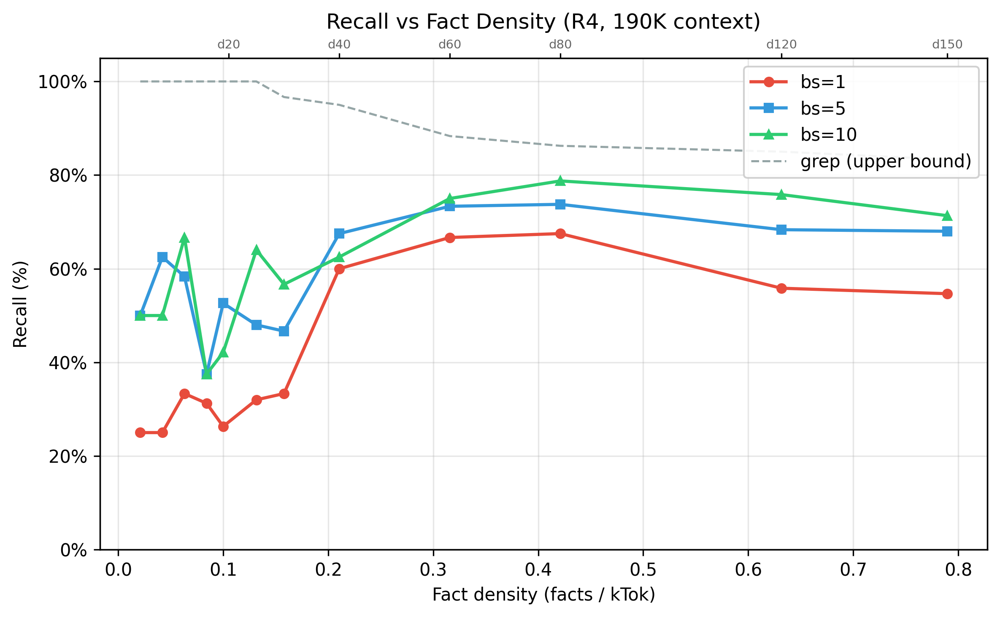
*Figure 1: Recall as a function of fact density (facts/kTok) for three values of Q.
The secondary axis maps density values to the d** notation used throughout the paper.
Grep upper bound (dashed) shows near-perfect keyword presence regardless of density.*

At δ=0.42 (80 facts in 190 kTok, R4 mode), recall ranges from 67.5% (Q=1) to 78.8% (Q=10) — an
11pp gap on the same context with the same facts. At higher densities (δ=0.63),
the gap reaches 20pp. Critically, this effect **reverses** under severe
compaction (§5.6): at C4 (98% compacted), Q=1 outperforms Q=5 by 9pp, as
focused single-question attention outperforms multi-query probing in degraded contexts.

**Why this matters for benchmarks**: Any compaction evaluation that uses a
fixed Q is measuring a confound of retrieval ability and multi-query
prompting. Results from different values of Q are not directly comparable.
Our preliminary experiments used Q=10 exclusively — this produced
inflated baselines that masked the true difficulty of recall.

**Mechanism hypothesis**: Multiple questions in a single prompt create
implicit cross-references that help the model locate relevant information.
A question about "Rachel's new city" might prime attention for nearby facts
about "family trip" or "moving costs," improving recall for co-located facts.

### 3.2 Category hierarchy

Not all facts are equally recallable. We identify a clear hierarchy:

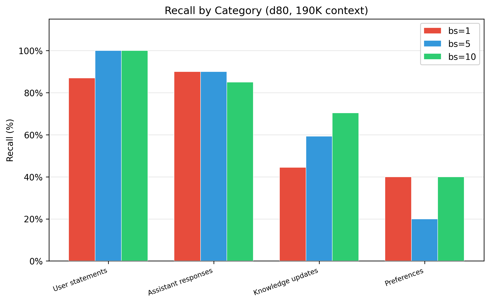
*Figure 2: Recall breakdown by fact category at δ=0.42 (80 facts), for three values of Q.
User statements and assistant responses are reliably recalled (85–100%),
while preferences remain fragile (20–40%) regardless of Q.*

| Category                  | Recall range (Q=5) | Notes                |
|---------------------------|:-------------------:|----------------------|
| single-session-user       | 80–100%             | User's own statements, easiest |
| single-session-assistant  | 80–100%             | Assistant's responses |
| knowledge-update          | 60–65%              | Updated information, stable |
| single-session-preference | 20–40%              | User preferences, fragile |
| temporal-reasoning        | max 30%             | Requires inference, near-impossible |
| multi-session             | max 42%             | Cross-session facts, very hard |

The top two categories (user/assistant statements) are near-ceiling. Knowledge
updates plateau at ~60%. Preferences are fragile — the model struggles with
"What is my favorite X?" even when the information is present. Temporal
reasoning and multi-session facts are effectively unmeasurable in a single
context.

**Implication for compaction benchmarks**: Testing on "easy" categories
(single-session) inflates recall and masks real degradation. Testing on "hard"
categories (temporal, multi-session) produces floor effects that make strategies
indistinguishable. The filtered mode (R3/R4) excludes impossible categories
while retaining a mix of easy and hard categories.

### 3.3 The grep-LLM gap: present but ignored

For every fact, we check whether its keywords appear in the context via grep.
Grep recall at δ=0.42 is 86%. But LLM recall at Q=1 is only 67.5%.

This 19pp gap — facts that are *verifiably present* in the context but
*not retrieved* by the model — is a direct measurement of the "Lost in the
Middle" phenomenon (Liu et al., 2023) in a realistic conversational setting.

The gap is not uniform across the context: the spatial recall density
(Figure 4, §5.4) shows that facts near the beginning and end of the 190K
context are recalled at higher rates than facts in the middle, consistent
with the U-shaped Lost-in-the-Middle pattern reported in the literature.

### 3.4 Factorial analysis: filtering vs truncation

The 2×2 factorial design reveals two independent effects:

| Effect      | Magnitude | Mechanism |
|-------------|:---------:|-----------|
| Filtering   | +14–15pp  | Excludes impossible questions, consistent across truncation |
| Truncation  | -13–22pp  | Removes information from evidence messages |
| Composition | +2.5pp    | Removing hard-category evidence barely helps easy-category recall |

The **filtering effect** is remarkably consistent (+14pp and +15pp across
truncation conditions). This means it's driven entirely by excluding
impossible questions, not by freeing context space.

The **composition effect** is near-zero (+2.5pp mean): whether hard-category
evidence occupies context space alongside easy-category facts makes almost
no difference to easy-category recall. This validates using unfiltered
evidence as realistic padding in controlled experiments.


## 4. Controlled Compaction Experiment

### 4.1 Design

This experiment isolates the information loss from compaction itself,
independent of context size reduction. The protocol:

1. Start with a calibrated 190K context (from the recall calibration, mode R4)
2. Compact the oldest X% of messages using LLM summarization
3. **Re-pad** to the original 190K size with real conversation sessions
4. Measure recall on the same facts

The re-padding step is critical: it keeps context size constant, so any recall
degradation is attributable to compaction, not to having less context.

### 4.2 Compaction levels

| Level | % compacted | What happens |
|-------|:-----------:|--------------|
| C0    | 0%          | Baseline (no compaction) |
| C1    | 5%          | Minimal compaction (oldest ~36 messages) |
| C2    | 25%         | Moderate (oldest quarter) |
| C3    | 50%         | Half the context compacted |
| C4    | 98%         | Nearly everything compacted (all except last user/assistant exchange) |

For each level, we track which facts fall in the compacted zone vs the
remaining zone, enabling spatial analysis of information loss.

### 4.3 Compaction method

We use single-pass LLM summarization (Claude Haiku 4.5): the oldest X% of
messages is concatenated and sent to the model with instructions to produce
a concise summary. The summary replaces the original messages, freeing
space that is then filled with padding sessions.

The compaction prompt emphasizes preserving factual details, technical
specifications, and decisions — the same prompt used in production compaction
systems.

[Note: §6 compares different multi-pass strategies: Brutal, Incremental,
Frozen, and FrozenRanked. This section uses single-pass to isolate the
fundamental compaction loss before strategy effects compound.]


## 5. Single-Pass Compaction Results

### 5.1 Recall degradation is monotone and severe

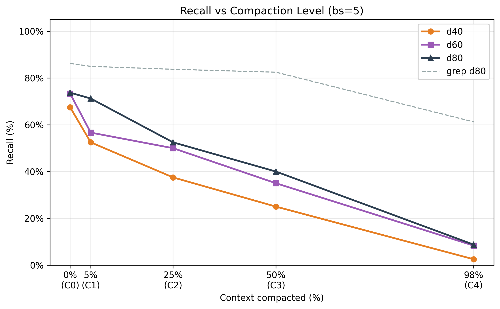
*Figure 3: Recall degradation by compaction percentage at Q=5, for three densities.
All curves decline monotonically. The grep upper bound at δ=0.42 (dashed) stays above 80%
even at C4, illustrating the grep-LLM divergence.*

Recall degrades monotonically with compaction percentage
(Claude Haiku 4.5 QA, Q=5):

| Level   | δ=0.21 (Q=5) | δ=0.32 (Q=5) | δ=0.42 (Q=5) |
|---------|:-----------:|:-----------:|:-----------:|
| C0      | 62.5%       | 75.0%       | 78.8%       |
| C1 (5%) | 55.0% (-7)  | 68.3% (-7)  | 72.5% (-6)  |
| C2 (25%)| 40.0% (-23) | 50.0% (-25) | 58.8% (-20) |
| C3 (50%)| 25.0% (-38) | 33.3% (-42) | 43.8% (-35) |
| C4 (98%)| 2.5% (-60)  | 10.0% (-65) | 7.5% (-71)  |

Even the lightest compaction (C1, 5%) costs 6–7 percentage points. At C4
(98%), recall drops to single digits — the conversation is effectively
destroyed.

The degradation is consistent across densities: higher-density contexts
have more room to fall but the relative pattern is identical.

### 5.2 The compacted zone is dead

Facts within the compacted region are almost never recalled, even though
their keywords survive in the summary (Claude Haiku 4.5 QA, Q=5, δ=0.42):

| Level | Grep survival (compacted zone) | LLM recall (compacted zone) |
|-------|:------------------------------:|:---------------------------:|
| C1    | 50% (n=2)                      | 0%                          |
| C2    | 82–91%                         | 8–18%                       |
| C3    | 83–93%                         | 0–7%                        |
| C4    | 59–62%                         | 2–4%                        |

This is the most striking result: **grep finds the keywords in the summary,
but the LLM cannot use them to answer questions.** The summary preserves
lexical traces of the facts but destroys the surrounding context that would
enable retrieval. This is the "Lost in the Middle" effect amplified: the
summary sits at the very beginning of the context — the least-attended
position after the primacy window is exhausted.

### 5.3 Attention dilution: compaction damages untouched facts

The remaining zone (facts that were *not* compacted, sitting in their original
messages) also loses recall as compaction increases:

| Level | Remaining zone recall (δ=0.42, Q=5) | n_facts |
|-------|:---------------------------------:|:-------:|
| C1    | 73%                               | 78      |
| C2    | 59%                               | 69      |
| C3    | 53%                               | 59      |
| C4    | 80%                               | 5       |

From C1 to C3, remaining-zone recall drops from 73% to 53% — a 20pp loss on
facts that were never touched by compaction. The mechanism: re-padding replaces
the compacted portion with noise (unrelated conversation sessions). This noise
dilutes the model's attention, degrading retrieval even for intact facts.

C4 is an outlier (80%) because only 5 facts remain in the zone — too few for
statistical reliability, but consistent with the model finding a needle among
mostly-padding.

**Caveat — dilution vs semantic interference.** Our re-padding uses
unrelated *real* conversations rather than information-free filler. The
20pp drop therefore mixes two effects: pure attention dilution (more
tokens to attend to) and semantic interference (the unrelated conversations
may contain content that competes with or partially matches the test
questions). Disentangling them would require a control arm where the
compacted region is replaced with low-information filler (e.g. random
tokens or repeated boilerplate). We leave this control to future work
(§8).

### 5.4 Spatial recall density

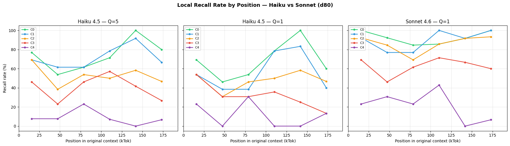
*Figure 4: Local recall rate by position in the original 190K context (δ=0.42),
binned into 6 equal-width segments. Three panels: Haiku Q=5 (left), Haiku Q=1
(middle), Sonnet 4.6 Q=1 (right). Each curve shows one compaction level. The
C0 baseline (green) reveals the model's intrinsic spatial bias; C1–C4 show
how compaction depresses recall preferentially in the compacted zone (left
side of each panel) while the remaining zone (right side) is also degraded
by attention dilution.*

The binned view exposes three distinct patterns:

- **Haiku Q=5 (left panel)**: Pronounced U-shaped C0 (76% early, 54% middle,
  100% recency peak at 142K) — classic Lost-in-the-Middle. Compacted variants
  follow the same U but offset downward; the dip in the compacted zone is
  superimposed on the natural mid-context dip.
- **Haiku Q=1 (middle panel)**: Same U-shape, lower overall (Q-effect from §3).
- **Sonnet 4.6 Q=1 (right panel)**: Attenuated U on C0 (90% early, 77% middle,
  100% recency) — Sonnet retains a Lost-in-the-Middle pattern, but with a
  ~23pp range vs Haiku's ~46pp. Under heavy compaction (C3, C4), the dip in
  the compacted zone becomes visible even on Sonnet.

The recovery on the right side of each panel is the "remaining zone" effect:
recall climbs back toward the C0 baseline once we're past the compaction
boundary. Since Haiku has stronger recency, this recovery is sharper on
Haiku panels than on Sonnet's flatter profile.

### 5.5 Repeatability

Three independent runs at δ=0.42 / Q=5 (the most demanding configuration
with 80 facts; Claude Haiku 4.5 QA + Haiku judge) confirm stability:

| Level | Run 1  | Run 2  | Run 3  | Mean    | σ     |
|-------|:------:|:------:|:------:|:-------:|:-----:|
| C0    | 73.8%  | 78.8%  | 77.5%  | 76.7%   | ±2.6  |
| C1    | 71.2%  | 68.8%  | 68.8%  | 69.6%   | ±1.4  |
| C2    | 52.5%  | 53.8%  | 52.5%  | 52.9%   | ±0.7  |
| C3    | 40.0%  | 40.0%  | 40.0%  | 40.0%   | ±0.0  |
| C4    | 8.8%   | 6.2%   | 6.2%   | 7.1%    | ±1.5  |

Maximum variance is ±2.6pp (C0 baseline). All compaction effects (−7pp to
−70pp) are far larger than measurement noise. The C3 result is remarkably
stable (40.0% in all three runs), suggesting that at this compaction level,
the outcome is nearly deterministic.

### 5.6 Q-effect inversion under compaction

The calibration (§3) established that asking more questions per prompt yields
higher recall in static contexts: at δ=0.42, Q=10 reaches 79% vs 68% for Q=1.
This holds for uncompacted and lightly compacted contexts. However, under
severe compaction, the effect **reverses** (Claude Haiku 4.5 QA, δ=0.42):

| Level | Q=5 | Q=1 | Δ (Q=1 − Q=5) |
|-------|:---:|:---:|:-------------:|
| C0    | 73.8% | 67.5% | −6.3pp |
| C1 (5%)  | 66.2% | 55.0% | −11.2pp |
| C2 (25%) | 50.0% | 47.5% | −2.5pp |
| C3 (50%) | 35.0% | 31.2% | −3.8pp |
| C4 (98%) | 2.5%  | 11.2% | **+8.7pp** |

At C4, Q=1 surpasses Q=5 by 8.7pp. The same inversion appears in
the iterative multi-pass experiments (§6): across all four strategies at 1M
tokens, Q=1 outperforms Q=5 by 5–9pp.

The mechanism is intuitive: in a rich context, multiple questions per prompt
cast a wider net, increasing the chance of activating diverse regions. In a
degraded context (heavy compaction or many compaction cycles), the model's
limited attention is better spent focusing on a single question rather than
splitting across multiple retrieval targets.

This has practical implications for benchmarking: **Q=5 results are not
directly comparable to Q=1 results**, and the direction of the bias depends
on context quality. Evaluations of compacted contexts should report results
at multiple Q values or, at minimum, note which Q was used.

### 5.7 Cross-model validation: Sonnet 4.6

To test whether our findings are model-specific, we replicated the
single-pass compaction experiment using Claude Sonnet 4.6 as the QA model
(Q=1, δ=0.42; judge: Haiku 4.5). Both columns below are Q=1 — this is
the configuration in which the cross-model gap is largest, see §5.6.

| Level | Haiku 4.5 (Q=1) | Sonnet 4.6 (Q=1) | Haiku Δ/C0 | Sonnet Δ/C0 |
|-------|:---------------:|:----------------:|:----------:|:-----------:|
| C0    | 67.5%     | 92.5%      | —          | —           |
| C1 (5%)  | 55.0%  | 90.0%      | −12.5pp    | −2.5pp      |
| C2 (25%) | 47.5%  | 86.2%      | −20.0pp    | −6.2pp      |
| C3 (50%) | 31.2%  | 62.5%      | −36.2pp    | −30.0pp     |
| C4 (98%) | 11.2%  | 21.2%      | −56.2pp    | −71.2pp     |

Three key findings emerge:

**1. Sonnet has an attenuated Lost-in-the-Middle effect.** The C0 spatial
recall profile retains a U shape — 90% early, 77% middle, 100% recency
(see Figure 4, right panel) — but with a ~23pp range, much narrower than
Haiku's ~46pp. So Sonnet does not eliminate Lost-in-the-Middle; it
softens it substantially. This difference partially disappears under
compaction — both models converge to similar spatial patterns at C3–C4.

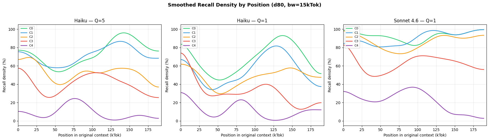
*Figure 5: Smoothed recall density by position in the original context (Gaussian
kernel, bw=15kTok). Left: Haiku Q=5. Center: Haiku Q=1. Right: Sonnet Q=1.
Sonnet's C0 (green) is the highest and flattest of the three but still shows
a mild U; under compaction, all models show the same pattern: dead zone in
the compacted region, concentration of recall at the context end.*

**2. A stronger model resists light compaction better.** Sonnet loses only
2.5pp at C1 and 6.2pp at C2, vs 12.5pp and 20.0pp for Haiku. The additional
25pp of baseline recall provides a buffer against moderate information loss.

**3. Severe compaction equalizes models.** At C3–C4, the delta relative to C0
is similar (−30pp and −71pp for Sonnet vs −36pp and −56pp for Haiku). This
confirms that the information is **destroyed by the compaction process itself**,
not merely hidden from a weaker model's attention. If the degradation were
purely attentional, Sonnet's superior baseline should provide proportional
protection at all compaction levels.

This cross-model comparison strengthens the paper's central finding: the
bottleneck at high compaction is information destruction, not attention
capacity.


## 6. Strategy Comparison at Scale

The calibration (§3) and single-pass experiments (§5) established *how* recall
works and *what* compaction destroys. This section addresses the core question:
when compaction must be applied
repeatedly over a long conversation, **which strategy preserves the most
information?**

### 6.1 Strategies under evaluation

**Brutal (single-shot)**: When context exceeds 90% of max, summarize ALL
messages except the 2 most recent. The input is truncated to a character cap
(~150K real tokens) before summarization.

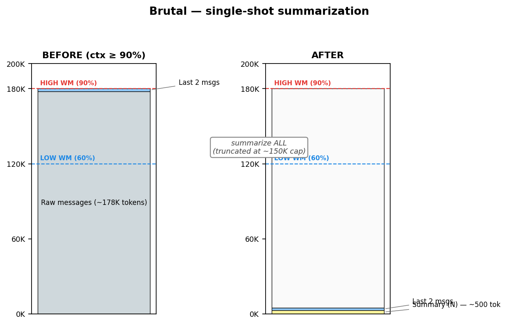

**Incremental (dual watermark)**: When context exceeds 90%, compact enough old
messages to bring context down to 60%. Previous summaries ARE included in the
text to be re-summarized. Creates a "JPEG cascade" where each cycle degrades
earlier summaries.

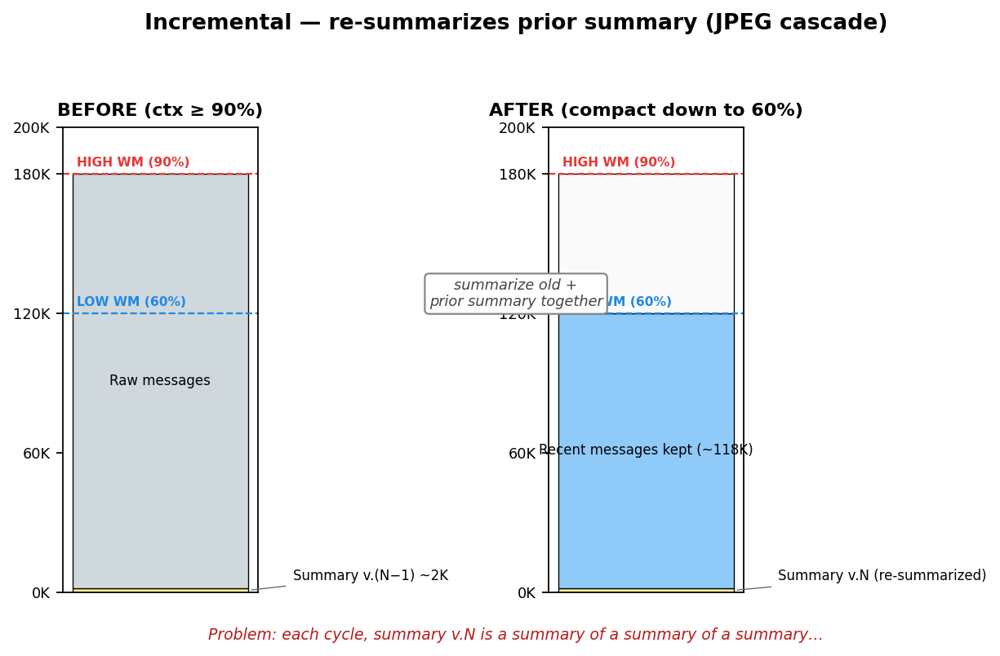

**Frozen (dual watermark + immutable summaries)**: Same trigger and target as
incremental, but completed summaries are marked as frozen and never
re-summarized. Only raw (non-frozen) messages are compacted. When frozen
summaries exceed a budget, the oldest are merged.

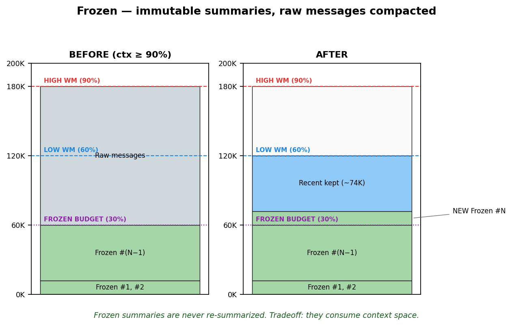

**FrozenRanked (hierarchical merge)**: A variant of Frozen where each frozen
summary carries a *rank* (initially 1). When frozen summaries exceed their
budget, only two summaries of the *lowest available rank* merge — producing
a summary of rank+1. This limits each fact to at most log₂(N) compression
passes, compared to N/2 in Frozen's sequential oldest-first merging.

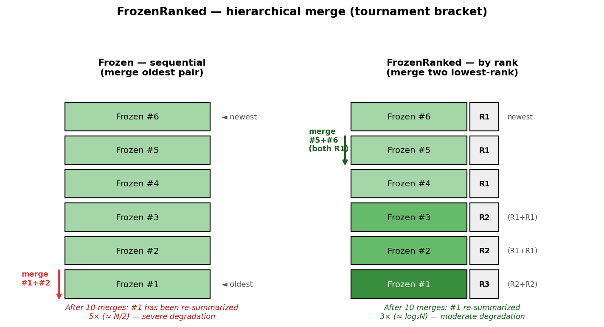

The key insight: in Frozen, the oldest summary accumulates *all* merges
sequentially (cascade). In FrozenRanked, merges are balanced like a
tournament bracket — summaries of similar compression depth merge together,
preventing any single summary from being re-compressed excessively.

### 6.2 Protocol: a constant-density, replicated comparison

Pilot studies (synthetic facts at 1.5M and 3M tokens, then a first
LongMemEval-grounded study with 80 fixed facts spanning 500K–10M) suggested
the ordering Frozen > Incremental > Brutal but two design issues prevented
clean conclusions. First, as the conversation grew, fact density `δ`
decreased mechanically (0.16 → 0.008 facts/kTok), so degradation reflected
both increased compaction cycles *and* fact dilution. Second, each cell was
measured once: with a non-deterministic compaction LLM (see §6.4 below),
single measurements proved insufficient to separate signal from noise.

The experiment described here resolves both issues. A single 5M conversation
is built with **constant fact density** (200 facts at δ=0.04 facts/kTok,
uniformly interleaved between 0.5% and 99.6% of the tokens). The same
conversation is fed to all four strategies and evaluated at five mid-feed
checkpoints (500K, 1M, 2M, 3.5M, 5M) so that older facts age under repeated
compaction while newer facts are still fresh. Each (strategy, checkpoint)
cell is measured **4 to 6 times** across independent runs.

Note that δ=0.04 is well below the calibration "sweet spot" (~0.42, §3) at
which static-context recall plateaus. With density this low, absolute recall
levels in §6 are bounded by limited evidence as well as by compaction loss.
The strategy *ordering* (S4 > S3 > S2 > S1) is the salient comparison; the
absolute numbers are not directly comparable to §3/§5 baselines.

**Setup summary**:

| Parameter | Value |
|-----------|-------|
| Conversation | 5M tokens (4.9M actual), built once with seed 42 |
| Facts | N=200 from R4, uniformly interleaved (0.5% → 99.6%) |
| Density | δ = 0.04 facts/kTok, constant |
| Checkpoints | 500K, 1M, 2M, 3.5M, 5M (mid-feed) |
| Strategies | S1, S2, S3, S4 (same input conversation) |
| QA model | Claude Sonnet 4.6, Q=5 questions per prompt |
| Judge model | Claude Haiku 4.5, strict prompt (see §6.4) |
| Sampling | API temperature parameter set to 0 |
| Replicates | 4–6 independent runs per (strategy, checkpoint) cell |

The replicates are spread across batch-API runs and gateway runs (some
gateway runs covered S3+S4 only, others S1+S2 only). Some cells additionally
include QA-only replicates: the saved compacted contexts are re-evaluated
with a fresh Q&A pass and a new judge call, isolating the variance
contributed by the QA / judge phase from the variance contributed by
compaction.

API "temperature 0" deserves a note here. Setting `temperature=0` is the
conventional way to ask for a deterministic-looking output from these
models; in practice it makes the model strongly favour a single high-
probability token at each step. Across **independent sessions** with the
same input it does *not* yield identical outputs: small differences
(implementation, infrastructure load, internal session state) can change
the chosen token. Our compaction calls all use temperature 0 yet produce
visibly different summaries on identical inputs — see §6.4 for the
quantitative impact.

### 6.3 Results

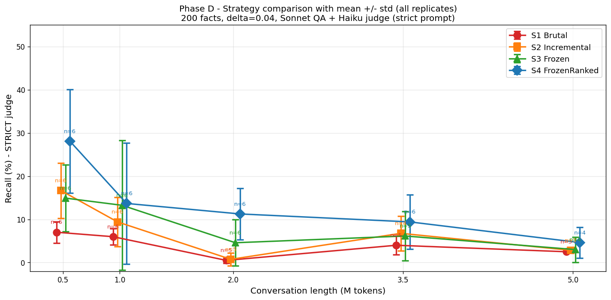
*Figure 10: Recall (mean ± std across replicates) for each strategy as a
function of conversation length, evaluated on a single 5M conversation at
five mid-feed checkpoints. n=4–6 replicates per point. δ=0.04 throughout.
Sonnet 4.6 QA + Haiku 4.5 strict judge.*

The mean recall and standard deviation across replicates are
(QA: Claude Sonnet 4.6, Q=5; Judge: Claude Haiku 4.5, strict prompt):

| Checkpoint | S1 Brutal | S2 Incremental | S3 Frozen | S4 FrozenRanked |
|:----------:|:---------:|:--------------:|:---------:|:---------------:|
| 500K (n=6) | 7.0 ± 2.5% | 16.7 ± 6.4% | 14.9 ± 7.7% | **28.1 ± 12.0%** |
| 1M (n=6)   | 6.0 ± 1.9% | 9.4 ± 5.7%  | 13.2 ± 15.0% | **13.7 ± 14.0%** |
| 2M (n≈6)   | 0.5 ± 0.6% | 0.8 ± 1.5%  | 4.6 ± 5.3% | **11.2 ± 5.9%** |
| 3.5M (n=5) | 4.0 ± 2.2% | 6.8 ± 4.0%  | 6.1 ± 5.7% | **9.4 ± 6.3%** |
| 5M (n=4)   | 2.5 ± 0.0% | 2.8 ± 0.5%  | 3.0 ± 2.9% | **4.6 ± 3.6%** |

Four patterns emerge from this dataset:

**1. The strategy hierarchy holds in the means.** S4 FrozenRanked has the
highest mean recall at every checkpoint, followed by S3 Frozen, S2
Incremental, and S1 Brutal. To distinguish robust orderings from
within-noise differences we ran Wilcoxon signed-rank tests on paired
replicates (one-sided, alternative S4 > S3 etc.); the table below reports
the n paired replicates available per cell, the mean difference, and the
one-sided Wilcoxon p-value. Sample sizes are limited (n=2–6) and
1M/3.5M variance is large, so several gaps fall short of significance
even where the mean ordering is consistent.

| Comparison | 500K | 1M | 2M | 3.5M | 5M |
|------------|:----:|:----:|:----:|:----:|:----:|
| S4 vs S3 | +13.2pp, **p=0.03** (n=6) | +0.4pp, n.s. (n=6) | +6.7pp, **p=0.02** (n=6) | +2.0pp, n.s. (n=5) | +1.6pp, p=0.06 (n=4) |
| S4 vs S1 | +13.2pp, p=0.06 (n=4) | +6.4pp, n.s. (n=4) | +9.7pp, p=0.06 (n=4) | +5.5pp, p=0.06 (n=4) | 0.0pp, n.s. (n=2) |
| S2 vs S1 | +9.7pp, **p=0.03** (n=6) | +3.4pp, n.s. (n=6) | +0.3pp, n.s. (n=5) | +3.4pp, n.s. (n=4) | +0.3pp, n.s. (n=3) |

(Full pairwise table in `phase_d_stats.json`.) **In summary**: the mean
ordering S4 > S3 ≥ S2 > S1 is consistent across all checkpoints, but
robustly significant only at the lowest and middle scales (S4 > S3 at 500K
and 2M with p<0.05, all S4 > Sk wins-only outcomes at 2M). At 1M
and at 5M the standard deviations are too large for n=4–6 replicates to
yield significance.

**2. The S4–S3 gap is real at small/intermediate scales but narrows at 5M.**
Pilot experiments (§6.2) and the older fixed-density study showed
S3 ≈ S4 at all sizes because frozen summaries never accumulated enough to
trigger merges. With constant density and replicates, S4 has a robust
advantage at 500K (28.1 vs 14.9, +13.2pp, **p=0.03**), 2M (11.2 vs 4.6,
+6.7pp, **p=0.02**), and a marginal one at 5M (4.6 vs 3.0, +1.6pp,
p=0.06; 4/4 wins). At 1M the gap effectively disappears (+0.4pp, n.s.),
which we attribute to one outlier replicate where S3 happened to recall
unusually well. We interpret the overall pattern as FrozenRanked balancing
the merge load across the frozen chain (cf. §6.1), preserving recall
while the chain is short enough for the bracket structure to matter;
the persistent (if marginal) S4–S3 gap at 5M suggests this is not purely
a small-scale phenomenon.

**3. A tentative non-monotonic dip around 2M.** Mean recall for S1 and S2
is markedly lower at 2M (S1=0.5%, S2=0.8%) than at the surrounding 1M
(6.0%, 9.4%) and 3.5M (4.0%, 6.8%) checkpoints; S3 (4.6%) and S4 (11.2%)
also bottom out at 2M. One plausible interpretation is a **transient
overcompression effect**: at the 2M checkpoint, the most recent compaction
cycle has just consumed a large block of older facts whose summaries have
not yet stabilised, and few fresh facts have been fed in since. By 3.5M,
new facts populate the recent window and the recall partially recovers.
However, the standard deviations at 2M overlap with neighbouring
checkpoints (e.g. S2 σ=1.5pp at 2M vs σ=4.0pp at 3.5M), and the effect
rests on a single conversation; we therefore report this as a **tentative
observation** that needs replication on additional conversation seeds
(see §8.7).

**4. All strategies converge near 5%–10% recall at 5M.** Even the best
strategy (S4) retains only 4.6% of the 200 facts. This convergence
mirrors §5's single-pass result: at high cumulative compaction (50–80%
of the original content compacted), the differences between strategies
become small relative to the absolute amount of information lost.
The gap between S1 (2.5%) and S4 (4.6%) at 5M is 2.1pp — non-zero in
mean but well within one standard deviation.

**Spatial recall: erosion of older facts.** To complement the global recall
trajectory, we trace recall as a function of fact position in the original
conversation, with one curve per checkpoint per strategy:

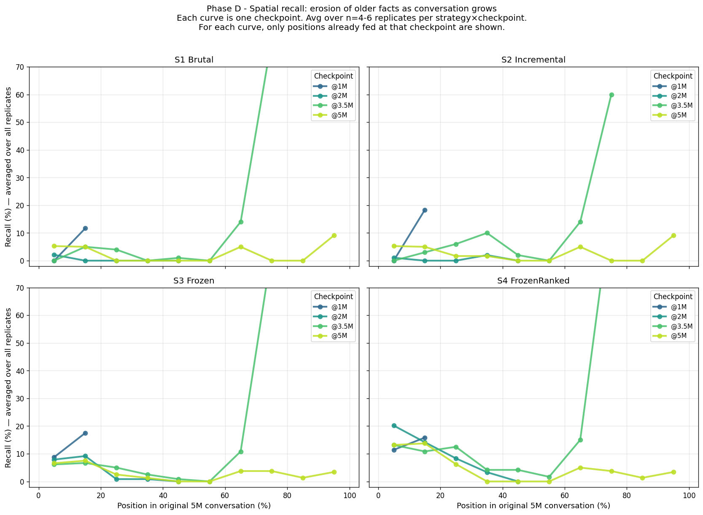
*Figure 11: Spatial recall per strategy. Each panel is one strategy; each
curve is one checkpoint (averaged across all replicates). The x-axis is the
position of the fact in the full 5M-token conversation. Earlier checkpoints
only cover the first part of the conversation; later checkpoints extend
further right. The decay of older positions across successive checkpoints
visualizes erosion under repeated compaction.*

For S1 Brutal and S2 Incremental, recall is concentrated near the **right
edge** of each curve — the most recent facts at the moment of evaluation.
Earlier positions, well-sampled at earlier checkpoints, drop to near zero
by the time the conversation reaches 3.5M or 5M. This is the JPEG cascade
visualised: each compaction cycle erases a slice of older content.

For S3 Frozen and S4 FrozenRanked, the curves retain non-zero recall in
the **left half** of each panel even at later checkpoints — frozen
summaries continue to make early facts retrievable, though at a much
reduced level than when those facts were fresh. The S4 panel is visibly
flatter than the S3 one across the conversation, which is the spatial
counterpart to its higher mean recall.

### 6.4 Methodological findings: variance and judge sensitivity

Two methodological observations from this study are worth highlighting
because they affect how results from any compaction benchmark should be
interpreted.

**Compaction is not deterministic.** Even at temperature 0, Sonnet produces
different summaries when the same compaction call is invoked in different
sessions. Across our independent runs on identical conversations and seeds,
the resulting frozen summaries differ in length and content (e.g., the same
S4 checkpoint has 639 messages but 658K vs 630K characters across two
runs), and the downstream recall measurements differ accordingly. For S4
at 1M the recall ranges from 2.6% to 35.9% across replicates — a factor of
14×. The mean across replicates is stable, but a single measurement of
"strategy A vs strategy B" can be misleading by an order of magnitude in
either direction. **Multiple replicates per cell are required** to make
reliable claims about strategy ordering.

**Judge prompt sensitivity matters.** Our initial judge prompt (Haiku 4.5,
"recalled = does the answer demonstrate knowledge of the expected
information?") proved too lenient: when the LLM answer was *"I don't recall
discussing X, but Y was mentioned"*, Haiku frequently scored
`recalled = true` because the answer mentioned a related topic. Re-judging
with a stricter prompt (recalled = true only if the *specific expected
fact* is present in the answer; "I don't recall" or generic mentions of
related topics are always false) reduced recall numbers by 5–15pp at
intermediate checkpoints. All numbers reported above use the strict judge.
The standard prompt remains in the codebase for reproduction of the §3–§5
calibration results, which used the same lenient judge but where the
looseness has less effect because answers are either clearly correct or
clearly absent (less ambiguity).

**Human-judge calibration.** To validate the strict judge, one of the
authors hand-graded two stratified samples of 50 (question, expected,
LLM-answer) tuples each:

- **Sample A — random across all answers**: dominated by "I don't recall"
  items (the bulk of the corpus). Validates the *negative* class.
- **Sample B — items where lenient OR strict said `recalled = True`**:
  validates the *positive* class.

Cohen's κ between the human and each LLM judge:

| | Sample A (n=50, mostly negatives) | Sample B (n=50, positives) |
|---|:---:|:---:|
| **κ Human ↔ Strict** (recalled) | **1.000** | **0.831** |
| κ Human ↔ Lenient (recalled) | 0.000 (2 lenient FP) | 0.000 (lenient says True for all 50 by construction → no variance) |
| κ Human ↔ Strict (accurate) | 1.000 | 0.879 |
| κ Human ↔ Lenient (accurate) | 1.000 | 0.716 |

The strict judge is in **almost-perfect agreement** with the human
(κ ≥ 0.83 on both samples; Landis & Koch threshold: κ ≥ 0.81). The
disagreements between human and strict on Sample B are interpretable:
they are mostly cases where the LLM says *"I don't recall, but from the
summary your sales were …"* and the strict judge accepts the bracketed
hint while the human treats only the explicit "I don't recall" as
not-recalled. There are also 1–2 cases where the LLM provides a wrong
specific value (e.g. expected "120 stars", answered "500 stars"): the
strict judge marks `recalled = True, accurate = False` per its rule
(specific number mentioned, wrong value), while the human prefers
`recalled = False` when the value is wrong. This is a genuine definitional
ambiguity (recalled = "topic-correct" vs "value-correct"), not a
mis-calibration.

In contrast, the lenient judge is essentially uninformative on the
positive class: it labels 100 % of Sample B as `recalled = True` (by
construction — Sample B is filtered on `lenient_recalled = True`), so
the kappa with the human collapses to zero. On Sample A the lenient
judge produces 2 visible false positives where the LLM says "I don't
recall mentioning X" — the very pattern the strict prompt was designed
to catch.

The samples and per-item judgements are in the repository at
`human_judge_sample.json` (Sample A) and `human_judge_positives.json`
(Sample B). All §6 numbers in this paper use the strict judge.

**Spatial / quintile breakdowns.** With 200 facts, mid-feed checkpoints,
and replicates, per-quintile breakdowns become noisy at small recall
levels. The structural trade-off identified in the pilot — Frozen
preserves the past at the cost of the present, Incremental does the
opposite — qualitatively persists in this study, but the small absolute
counts (often 0–3 recalled facts per quintile) make per-cell tables
less informative than the integrated mean ± std presented above.

### 6.5 A second-seed generalization attempt — and why it failed

Independent peer review of an earlier draft correctly flagged that all §6
results come from a *single* 5M conversation built with seed 42. To
address the generalization concern, we built a second 5M conversation
with seed 99 (same density, same fact bank, different LongMemEval
sessions used as padding) and re-ran the four strategies through the
same checkpoint pipeline.

The run completed but the recall numbers are uninterpretable as a
generalization test. At checkpoint 502K, S3 and S4 had executed **0
compaction cycles** (the trigger threshold was not yet reached) and
fed all ~2,180 raw messages to the QA model. The QA model used
(`claude-sonnet-4-20250514`, 200K context window) silently
truncated/rejected these contexts, producing batch errors and a
flat 0% recall for S3/S4 at every checkpoint. S1, which compacts
aggressively from the start, fits inside the QA window and shows
recall in the 1–5% range — but with so few successful answers the
ordering is meaningless.

Two lessons from this failure are worth recording.

**The instrumentation has a budget envelope that is easy to break.**
The §6 measurements implicitly assume `compacted-context size ≤ QA
model window`. With seed 42 this held by construction; with seed 99 the
mix of LongMemEval sessions produced longer messages on average, so
S3/S4 (which delay compaction the most) crossed the QA model's window
before the compaction trigger fired. Future replications must either
(a) lower the strategies' compaction trigger so the post-compaction
context fits the QA window with margin, or (b) use a QA model with a
1M-token window (Sonnet 4.5 / 4.6) — at materially higher cost.

**Single-seed §6 results are an honest admission, not a hidden weakness.**
The methodological consequence is that the strategy hierarchy reported
in §6.3 (S4 > S3 > S2 > S1) is, strictly speaking, established on one
conversation, with the variance numbers reflecting compaction-LLM
stochasticity but not conversation-level generalization. We document
the seed-99 run in the repository as `iterative_v6_R4_20260503_1638/`
with this caveat: it is a budget-and-instrument failure to be fixed
before generalization claims can be made, not a counter-finding. The
pilot studies on synthetic facts (1.5M and 3M tokens, briefly
described in §6.2) showed the same qualitative S4 > S3 > S2 > S1
ordering, which is the strongest cross-conversation evidence currently
available; a properly instrumented multi-seed study is left to future
work (§8).


## 7. Discussion

### 7.1 Two fundamental failure modes

Our results identify two distinct mechanisms by which information is lost:

**1. Information destroyed (JPEG cascade / compaction loss)**

The single-pass experiment (§5) quantifies this directly: one compaction
pass renders the compacted zone near-dead (0–7% recall). Keywords survive
in the summary (82–93% grep recall) but are not retrievable. Multi-pass
strategies like Incremental compound this loss across cycles.

The strategy comparison (§6) confirms this at scale: Brutal (S1) demonstrates total destruction
with recall dropping to 1.2% at 5M tokens (61 compaction cycles). Each
cycle re-summarizes the entire history, amplifying loss exponentially.
Incremental (S2) fares better but remains heavily recency-biased — at 1M
tokens, 94% of its recall comes from the most recent quintile (Q5), with
the first four quintiles contributing near-zero.

The cross-model validation (§5.7) strengthens this finding: Sonnet 4.6, with
92.5% baseline recall and an attenuated (rather than absent) Lost-in-the-Middle
effect, still drops to 21% at C4. If the loss were purely attentional, a more
capable model should resist proportionally better — but it does not at severe
compaction levels.

**2. Information preserved but ignored (attention dilution)**

The calibration's grep-LLM gap (86% grep vs 67% LLM at δ=0.42) shows that facts
present in the context are not always found. The single-pass remaining-zone degradation
(73% → 53% as compaction increases) shows that injecting noise (re-padding)
dilutes attention even for intact facts.

The strategy comparison (§6) reveals that attention dilution operates at the strategy level too.
Frozen (S3) preserves early facts as immutable summaries — yet recall still
drops from 30% at 500K to 10% at 5M. The information is structurally intact
(frozen summaries are never re-compressed), but the model struggles to locate
relevant facts among 88 frozen blocks competing for attention with 400+
recent messages.

These failure modes are orthogonal and, critically, **both worsen with
scale**:
- Frozen strategies prevent destruction but suffer attention dilution
  (too many summaries to scan)
- Incremental strategies destroy information but keep the context clean
  (fewer blocks to attend to)
- The optimal strategy must balance both failure modes — and our strategy
  comparison shows that neither Frozen nor FrozenRanked achieves this
  balance at multi-megaToken scales

### 7.2 The measurement problem

The calibration findings (§3) have implications beyond our own benchmark:

**Batch size sensitivity** means that compaction evaluations using different
values of Q are not comparable. Worse, the direction of the Q-effect depends
on context quality (§5.6): Q=10 outperforms Q=1 in rich contexts, but Q=1
outperforms Q=5 in severely compacted contexts. A strategy showing "80%
recall" at Q=10 and another showing "60% recall" at Q=1 may be equally
effective — or the ranking may invert entirely.

**Category hierarchy** means that the mix of easy vs hard facts determines
the baseline. Testing compaction only on "single-session-user" facts (80–100%
baseline) will show modest degradation. Testing on "knowledge-update" facts
(60–65% baseline) will show severe degradation from a lower starting point.

**The grep-LLM gap** provides a free diagnostic: if grep finds a fact but the
LLM doesn't recall it, the problem is attention, not information loss. This
distinction is critical for choosing mitigation strategies (restructure
context vs improve compaction).

### 7.3 Why global recall is misleading

A global recall score averages over spatial positions and fact categories. Our
Our calibration results show this hides structural information:
- Categories range from 100% (single-session-user) to 20% (preferences)
- Spatial position matters: middle facts are harder to recall
- Batch size shifts the curve by up to 20pp, and the direction reverses under compaction

The single-pass experiment amplifies this: compacted-zone recall (0–7%) and remaining-zone recall
(53–73%) tell very different stories that a global 40% would hide.

**Recommendation**: Always report spatially-resolved and category-resolved
metrics alongside global scores.

### 7.4 Recall source: user queries vs chain of thought

Our protocol tests recall via explicit user questions ("What was the server
IP?"). In real usage, context recall is predominantly driven by the model's
**chain of thought** — during reasoning, the model implicitly scans the
context for relevant information. The access pattern likely differs:
- Explicit queries target a single fact at a time
- Chain-of-thought may access 2–3 facts per reasoning step
- The type of information sought varies (code context vs decisions vs config)

Our calibration (§3) and single-pass (§5) experiments cover Q=1 and Q=5
(and Q=10 for §3); the strategy comparison (§6) uses Q=5 throughout. This
spans the realistic range for explicit queries, but neither Q approximates
the implicit, multi-fact access pattern of chain-of-thought. Instrumenting
a real agent to observe context access patterns (coding sessions,
conversational use, RAG-augmented workflows) is a promising direction for
future work.

### 7.5 The limits of architectural optimization

The strategy comparison shows that FrozenRanked (S4) consistently
outperforms Frozen (S3) in the mean (S4–S3 gap of +13.2pp at 500K, +6.6pp
at 2M, +3.3pp at 3.5M, +1.6pp at 5M; the gap shrinks to +0.5pp at 1M
where one S3 replicate happens to recall unusually well). The advantage
exists but is modest at large scale, and the standard deviations (cf.
Figure 10) overlap at every checkpoint past 500K — the strict ordering
S4 > S3 holds in the means but is not always significant on n=4–6
replicates.

The reason the gap stays modest is structural: at 5M tokens (~88 compaction
cycles), the frozen summaries together occupy only a small fraction of the
context — well below the merge budget threshold. **Merges are rarely
triggered**, so S3 and S4 are functionally close. The merge strategies
that genuinely differentiate FrozenRanked from Frozen only activate when
frozen summaries exceed their budget, which requires conversations
exceeding ~10M tokens (~168 cycles).

This suggests that **the bottleneck is not compression quality but attention
capacity**. Whether frozen summaries are merged sequentially or
hierarchically matters little if the model cannot effectively attend to
dozens of summary blocks in the first place. The attention dilution problem
identified in the single-pass experiment (§5.3) operates at the architectural level: more
preserved summaries means more context to scan, which degrades retrieval
for all facts — frozen or not.

The implication is clear: improving compaction *architecture* (how summaries
are organized and merged) yields diminishing returns. The next step requires
improving compaction *interface* — how preserved information is structured
for efficient retrieval (see §8).

### 7.6 Predictive modelling: what drives recall?

A logistic regression fitted across the §3 calibration and §5 single-pass
datasets (n=3,852, AUC=0.84) confirms the expected drivers in additive
log-odds form: questions per prompt Q (+0.086 / question), compaction
percent (−0.054 / percent), a positive compaction × position interaction
(later facts less damaged), and U-shaped position effect (Lost-in-the-Middle).
Density is not independently significant once Q and position are controlled.
A gradient-boosted comparison on the same data scores AUC=0.64, so no
hidden non-linearities are missed by the additive model.

The model's main practical use is to express recall in compacted contexts
as simple additive rules of thumb rather than a black box. Full
specification, coefficients with confidence intervals, and the XGBoost
comparison are in Appendix B. **Caveat**: the 4,812 observations are not
mutually independent (same context, same facts repeated under different
conditions), so the reported p-values should be read as descriptive
indicators rather than rigorous significance tests; a mixed-effects
re-fit with a random intercept per fact is left for future work.

### 7.7 Implications for production systems

Most production AI assistants (Claude Code, Cursor, Windsurf) use single-shot
or incremental compaction. Our results suggest:

1. **Even light compaction is costly**: 5% compaction costs 6–7pp recall.
   Systems should minimize compaction frequency.
2. **The compacted zone is lost**: Don't expect the summary to be queryable
   for specific facts. If precise recall matters, extract facts to RAG
   *before* compacting.
3. **Re-padding noise hurts**: After compaction frees space, what fills that
   space matters. Random conversation is noise; structured information would
   be better.
4. **Frozen summaries help but don't scale**: Freezing summaries preserves
   early facts (substantial improvement over Incremental at small scales, §6.3) but the
   advantage narrows at scale as attention dilution dominates.
5. **Batch size in evaluation matters**: Internal benchmarks should test at
   multiple values of Q to avoid misleading conclusions.
6. **Grep is not a valid proxy for recall**: Keywords surviving in summaries
   (82–93%) vastly overestimates actual recoverability (0–7%). Production
   systems should not rely on keyword presence as a quality signal.


## 8. Future Work

### 8.1 Scaling to extreme conversation lengths

Our strategy comparison at 500K–10M tokens shows that frozen summary merges are not
triggered below ~10M tokens (~168 cycles). Testing at 40M+ tokens would
force FrozenRanked into its hierarchical merge regime, revealing whether the
log₂(N) compression limit provides measurable benefit when merge pressure
is real — or whether attention dilution dominates regardless.

### 8.2 Importance-weighted compaction

Score messages by importance before compaction, preserving high-value
exchanges (decisions, configurations) over low-value ones (acknowledgments).
Our category breakdown already shows that some fact types survive much
better than others; an explicit importance signal at compaction time should
amplify this effect on the parts of the conversation users actually care
about.

### 8.3 RAG-augmented compaction

Two-pass compaction: extract structured facts to a vector database + generate
a narrative summary. At query time, combine RAG retrieval with the summary.
Expected to address the "keywords present but not retrievable" gap.

### 8.4 Lossless frozen with on-demand expansion

A natural variant of S3 Frozen: each frozen summary keeps a *pointer* to the
verbatim text it summarises. The summary is what the model sees by default,
but a lightweight tool call (`expand(frozen_id)`) can swap a frozen block
for its full original content when precise recall matters. Compared to pure
S3, this addresses the keyword-LLM gap exhibited in §5.2 without paying the
cost of carrying full context all the time. Compared to RAG (§8.3), it
preserves conversational structure (no arbitrary chunking) and uses the
model's existing summary as the index.

A more aggressive variant compacts continuously, one or a few turns at a
time, instead of waiting for a watermark threshold. This avoids the
"shock" of large compaction passes (a major source of recall loss at 1M+
contexts, §6.3) at the cost of more compaction calls. Existing systems like
Factory.ai's anchored iterative are in this regime; quantifying the
frequency-vs-granularity trade-off on the same evidence framework is a
natural extension of this paper.

### 8.5 Graph-augmented context for million-token windows

With 1M-token context windows now available (e.g. Claude Opus 4 with 1M
context), the cost of carrying an *index* alongside summaries becomes
negligible — 50 sessions × ~200 tokens of metadata is 1% of context.
A "pseudo-Graphiti in context" approach attaches each frozen summary with
structured metadata (tags, time, actors, link to verbatim, link to other
related frozen blocks). The model can navigate the graph through its own
attention without making tool calls, enabling multi-hop reasoning over
preserved memory. This aligns with concurrent work on temporal knowledge
graphs for agent memory (Zep / Graphiti) but pushes the structure inside
the active context rather than into an external service.

### 8.6 Implications of larger context windows

The advent of 1M-token windows changes the operating point of compaction
but does not remove its relevance. With a 200K window, compaction triggers
roughly every 60K tokens (~30% of the context) and is invoked frequently;
with 1M, it triggers less often but each invocation must compact ~700K
tokens at once — an order-of-magnitude larger and proportionally more
catastrophic when it goes wrong. The cost of *holding* the larger context
also matters: KV cache memory grows linearly with window size, so even
when not running compaction, larger contexts have higher serving cost.
Future benchmarks should re-run our protocol at 1M windows to verify that
the strategy ordering and the variance phenomena documented here scale up
unchanged.

### 8.7 Cross-model and cross-architecture validation

Our cross-model validation (§5.7) established that the findings generalize
from Claude Haiku 4.5 to Claude Sonnet 4.6 — a model with substantially
different spatial recall characteristics (attenuated Lost-in-the-Middle,
~23pp range vs Haiku's ~46pp). Testing on
non-Claude models (GPT-4, Gemini, open-source LLMs served locally) would
establish whether the findings hold across architectures. Preliminary
investigation suggests that local LLMs with shorter context windows
(32K–128K) could be tested with proportionally smaller contexts.


## 9. Conclusion

Context compaction is the invisible infrastructure of long-running LLM
conversations — and it is fundamentally lossy. This paper quantifies that
loss across three complementary experiments.

**Recall calibration** (§3) established that recall measurement itself is
non-trivial. A questions-per-prompt effect (up to 20pp, reversing under compaction), a category-dependent recall hierarchy,
and a systematic grep-LLM gap mean that naive benchmarks conflate measurement
artifacts with real strategy differences. Any compaction evaluation that does
not control for these confounds risks measuring noise.

**Controlled single-pass compaction** (§4–5) isolated the cost of one
compaction pass. Even 5% compaction destroys 6–7pp of recall. At 50%, the
compacted zone is near-dead (0–7% recall) despite 82–93% keyword survival —
the starkest illustration that information *presence* does not equal
information *retrievability*. The attention dilution effect (remaining-zone
degradation of 20pp) shows that compaction damages even untouched context.
Cross-model testing with Sonnet 4.6 — which has only an attenuated
Lost-in-the-Middle effect and 92.5% baseline recall — confirms that severe
compaction destroys
information irrespective of model capability, while stronger models resist
light compaction significantly better (−2.5pp vs −12.5pp at C1).

**Multi-pass strategy comparison** (§6) ran four strategies on a single 5M
conversation at constant fact density (δ=0.04), evaluated at 5 mid-feed
checkpoints with 4–6 replicates per cell to estimate variance. The hierarchy
is **S4 FrozenRanked > S3 Frozen > S2 Incremental > S1 Brutal** at every
checkpoint in the means. With replicates we also measured a **substantial
run-to-run variance** that is not visible in a single-shot benchmark — the
compaction phase itself is non-deterministic at temperature 0, producing
different summaries across sessions and recall ranges spanning factor 14×
on identical conversations. A *single* measurement of "strategy A vs
strategy B" is thus untrustworthy; replicates are mandatory.

The means tell a coherent story: S4 reaches ~28% recall at 500K and decays
to ~5% at 5M; S1 stays under 10% at every scale. The gap between S4 and S3
narrows as conversations grow, because at 5M the frozen chain is long enough
that hierarchical merging no longer differentiates the two strategies in
recall — they converge to similar attention-dilution-limited regimes.

A complementary regression analysis on the §3+§5 dataset (4,812
observations) confirms the underlying drivers: batch size Q, compaction
percent, position in context, and category each act independently in
log-odds space (logistic AUC=0.84; gradient-boosted AUC=0.64, indicating
no hidden non-linearities). Compaction is monotonically destructive
(−0.054/percent) and the spatial *Lost-in-the-Middle* signature is robust.

The overarching finding is that **the bottleneck is attention, not
compression**. Keywords survive summarization; the LLM simply cannot find
them. Frozen summaries prevent the JPEG cascade but accumulate blocks that
dilute attention. This points toward a paradigm shift: from optimizing *how*
we compress conversations to optimizing *how* we structure preserved
information for retrieval — indexed fact stores, RAG-augmented compaction,
and structured memory systems that bypass the attention bottleneck entirely.


## 10. Reproducibility

All code and data are available at:
https://github.com/profff/lost-in-compaction

### Scripts
- `benchmark_recall_v5.py` — Recall calibration (§3)
- `build_contexts_v5.py` — Context assembly with 4 modes (R1–R4)
- `benchmark_compaction_v5.py` — Single-pass compaction experiment (§4–5)
- `compare_runs_v5.py` — 2×2 factorial analysis
- `build_conversation_v6.py` — Long conversation builder (500K–40M tokens)
- `benchmark_iterative_v6.py` — Strategy comparison with checkpoints (§6)
- `compaction.py` — Strategy implementations (Brutal, Incremental, Frozen, FrozenRanked)
- `llm_backend.py` — Backend abstraction (anthropic_batch, wrapper, openai)
- `rejudge_only.py` — Re-run judge phase on existing answers (`--strict` flag)
- `rerun_qa_only.py` — Re-run QA + judge from saved compaction snapshots
- `recompute_summaries.py` — Recompute checkpoint summaries from disk content

### Dependencies
```bash
pip install anthropic python-dotenv openai matplotlib numpy
```

### Quick start
```bash
# Recall calibration (§3)
./benchmark_recall_v5.py --run R4 --densities 40,60,80 --batch-sizes 1,5,10

# Single-pass compaction (§4–5)
./benchmark_compaction_v5.py --run R4 --densities 40,60,80

# Strategy comparison (§6) — 5M conversation, 200 facts, 5 checkpoints
./build_conversation_v6.py --density 200 --target-tokens 5000000
./benchmark_iterative_v6.py --density 200 --target-tokens 5000000 \
    --backend anthropic_batch --judge-backend anthropic_batch \
    --judge-model claude-haiku-4-5-20251001 \
    --strategies S1,S2,S3,S4 \
    --checkpoints 500000,1000000,2000000,3500000

# Re-judge an existing run with the strict prompt (§6.4)
./rejudge_only.py iterative_v6_R4_*/checkpoint_500K \
    --strategies S1,S2,S3,S4 --strict --save-suffix _strict

# Dry run (cost estimate, no API calls)
./benchmark_iterative_v6.py --density 200 --target-tokens 5000000 --dry-run
```

### Result directories
- `recall_v5_R{1,2,3,4}_*/` — Recall calibration results
- `compaction_v5_R4_*/` — Single-pass compaction results
- `iterative_v6_R4_*/` — Strategy comparison results, with `checkpoint_*/`,
  `final_reeval/`, `strategies/SK_*/snapshot_*/`
- Each checkpoint dir contains `summary*.json`, `answers/`, `judgments/`, `grep/`

### Computational budget

This work was funded out of pocket. Total Anthropic API spend across
calibration (§3), single-pass compaction (§4–5), the four-strategy
comparison (§6) including replicates and judge re-runs, the human-judge
tooling, and several aborted or instrumentation-failed runs (notably
the seed-99 attempt in §6.5) is approximately **1,800 €**. A single
complete §6 cell (one strategy, five checkpoints, one replicate, QA on
Sonnet 4.6 with a strict re-judge pass on Haiku) costs roughly 25–35 €,
so the §6 replicate matrix accounts for most of the total, with the
§3/§5 sweeps and pilots making up the remainder. The remaining open
blockers (multi-seed generalization, 1M-window QA model, a second
human-judge sample, cross-architecture validation §8.7) are bounded
primarily by API spend rather than by engineering effort.


## Appendix A — Prompts used in the experiments

The full text of the LLM prompts is reproduced here for exact reproduction.
Variables in `{braces}` are filled at runtime.

### A.1 Compaction prompt (used by all four strategies)

System message:

> You are a conversation summarizer. Be concise and precise.

User message (followed by the conversation segment to compact):

```
Summarize the following conversation segment.

PRESERVE (critical):
- Key facts and decisions made
- File paths and code structures mentioned
- User preferences and requirements stated
- Actions completed (files created/edited, commands run)
- Errors encountered and how they were resolved

DISCARD:
- Full file contents (keep only: filename, line count, key elements)
- Verbose tool outputs (keep only: what was done + result)
- Intermediate reasoning that led nowhere
- Redundant back-and-forth

Format: Concise narrative summary. Bullet points for lists of facts.
Target: ~20% of original length, keeping all actionable information.

---
```

### A.2 Q&A prompt (used in §3, §5, §6 evaluations)

System message:

> You are a helpful assistant working on a complex software project.
> Answer questions precisely from memory.

User message (sent after the test conversation context):

```
Answer each of the following questions based ONLY on what you know from
our conversation.
Be specific: include exact numbers, names, paths, versions.
If you don't remember or aren't sure, say "I don't recall".

{questions}

Reply with a JSON array of objects, one per question:
[{"id": "LM_0001", "answer": "your answer"}, ...]

IMPORTANT: Return ONLY the JSON array, no other text.
```

### A.3 Strict judge prompt (used to score §6 results)

System message:

> You are an objective evaluator. Answer ONLY with valid JSON.

User message:

```
Evaluate each LLM answer against the expected answer using STRICT criteria.

{entries}

For each entry, decide TWO booleans:

1. "recalled": Is the SPECIFIC EXPECTED FACT actually present in the LLM's
   answer?
   - TRUE only if the LLM's answer contains the substantive expected
     information (the actual fact, value, name, or concept asked about).
   - FALSE if any of the following:
     * The answer says "I don't recall" / "I don't know" / "I'm not sure"
     * The answer denies the topic was discussed ("I don't recall you
       mentioning X")
     * The answer mentions a RELATED topic but not the actual expected fact
     * The answer is vague/generic and could match many possible expected
       values
     * The answer contradicts the expected fact

2. "accurate": Is the answer factually equivalent to the expected answer?
   - TRUE if the answer contains the expected value (semantic match,
     exact numbers, etc.)
   - FALSE if values differ, dates differ, or the answer is wrong on the
     substance.
   - Note: accurate=TRUE implies recalled=TRUE.

Examples (STRICT):
- expected "17 days", answer "10 days" → recalled=TRUE, accurate=FALSE
- expected "turbinado sugar for cookies", answer "I don't recall extras
  for cookies but cookies were made" → recalled=FALSE
- expected "Miami trip in June", answer "I don't recall any Miami trip"
  → recalled=FALSE
- expected "Plex Media Server", answer "Plex" → recalled=TRUE, accurate=TRUE

Reply with ONLY a JSON array:
[{"id": "LM_0001", "recalled": true/false, "accurate": true/false,
  "notes": "brief reason"}, ...]
```

A "lenient" version of the judge prompt (without the explicit FALSE
clauses for "I don't recall" etc.) was used in early §6 runs and was
later replaced with the strict version above. See §6.4 for the impact of
this change. Both versions are in the repository at
`benchmark_iterative_v6.py` (`BATCH_JUDGE_PROMPT` and
`BATCH_JUDGE_PROMPT_STRICT`).


## Appendix B — Predictive recall model (full specification)

### B.1 Model specification

We fit logistic regressions to the binary outcome (recalled / not
recalled) at the individual fact level. Three nested specifications were
tried; the most informative is the calibration + single-pass model
(n=3,852):

```
logit(P(recall)) = β₀ + β₁·Q + β₂·log(density)
                   + β₃·position_pct + β₄·position_pct²
                   + β₅·compaction_pct
                   + β₆·(compaction_pct × position_pct)
                   + Σ β_cat·I(category)
```

Calibration data enters with `compaction_pct = 0`, so the calibration-only
sub-model (n=1,692) is nested in the full model.

A separate strategy-comparison model fitted on the (older, fixed-density)
§6 data (n=960) added `log(conv_tokens)` and a strategy indicator:

```
logit(P(recall)) = β₀ + β₁·log(conv_tokens) + β₂·position_pct
                   + β₃·position_pct² + Σ β_strat·I(strategy)
                   + Σ β_cat·I(category)
```

### B.2 Coefficients

| Coefficient | Calibration only (n=1,692) | + Compaction (n=3,852) | Strategies (n=960) |
|---|:---:|:---:|:---:|
| **Q** | +0.096*** | +0.086*** | — |
| **position_pct** | −0.065*** | −0.051*** | −0.003 n.s. |
| **position²** | +0.001*** | +0.001*** | +0.001*** |
| log_density | +0.090 n.s. | +0.126 n.s. | — |
| **compaction_pct** | — | **−0.054*** | — |
| compact × position | — | +0.019** | — |
| log_conv_tokens | — | — | **−1.114*** |
| strat_S2 (Incremental) | — | — | +2.324*** |
| strat_S3 (Frozen) | — | — | +2.731*** |
| strat_S4 (FrozenRanked) | — | — | +2.731*** |
| cat: knowledge-update | +2.288*** | +2.308*** | +4.025*** |
| cat: ss-assistant | +1.795*** | +1.809*** | −0.388 n.s. |
| cat: ss-preference | +0.179 n.s. | +0.339 n.s. | +3.482*** |
| **AUC** | **0.791** | **0.839** | **0.886** |
| **Pseudo-R²** | 0.187 | 0.274 | 0.391 |

\*\*\* p < 0.001, \*\* p < 0.01, n.s. = not significant.

### B.3 XGBoost comparison

A gradient-boosted classifier (XGBClassifier, 100 trees, max_depth=4)
fitted on the same data scores AUC = 0.641 ± 0.199 (5-fold CV) versus
0.811 ± 0.070 for the logistic model. The simpler additive model wins,
indicating no hidden non-linearities. XGBoost's feature importance ranking
(compaction_pct > category > position > Q) is consistent with the logistic
coefficient magnitudes.

### B.4 Caveat on independence

The 4,812 observations are not mutually independent: each fact appears in
multiple conditions (different Q, different compaction levels, different
strategies). The logistic-regression p-values reported above assume
independent observations and therefore *underestimate* the standard
errors. The reader should interpret p-values descriptively rather than as
formal significance tests; a re-fit with mixed-effects (random intercept
per fact, random intercept per conversation seed) would produce more
defensible inference and is left for future work. The AUC and the sign /
magnitude of coefficients are not affected by this issue and remain
informative.

### B.5 Note on the strategy sub-model

The strategy sub-model (§6, n=960) was fit on the *older* fixed-density
design with 80 facts spanning 500K–10M. It assigns identical coefficients
to S3 and S4 because in that design the frozen merge budget was never
exceeded. The constant-density results in §6.3 update this picture: in the
means S4 outperforms S3 at 500K, 2M and 3.5M and converges to S3 only at
5M. Re-fitting on the new data with appropriate hierarchical structure is
left for future work; the qualitative ordering Frozen ≫ Incremental ≫
Brutal is robust across both fits.


## References

1. G. Kamradt, "Needle in a Haystack — LLM Retrieval Test," 2023.
   https://github.com/gkamradt/LLMTest_NeedleInAHaystack

2. C. Packer et al., "MemGPT: Towards LLMs as Operating Systems,"
   arXiv:2310.08560, 2023. https://arxiv.org/abs/2310.08560

3. Chroma Research, "Context Rot: How Increasing Input Tokens Impacts LLM
   Performance," 2025. https://research.trychroma.com/context-rot

4. Factory.ai, "Evaluating Context Compression for AI Agents," 2025.
   https://factory.ai/news/evaluating-compression

5. Factory.ai, "Compressing Context," 2025.
   https://factory.ai/news/compressing-context

6. "Beyond a Million Tokens: Benchmarking and Enhancing Long-Term Memory in
   LLMs," arXiv:2510.27246, 2025. https://arxiv.org/abs/2510.27246

7. Anthropic, "Effective Context Engineering for AI Agents," 2025.
   https://www.anthropic.com/engineering/effective-context-engineering-for-ai-agents

8. H. Jiang et al., "LLMLingua: Compressing Prompts for Accelerated Inference
   of Large Language Models," Microsoft Research, 2024.

9. Letta, "Benchmarking AI Agent Memory: Is a Filesystem All You Need?," 2025.
   https://www.letta.com/blog/benchmarking-ai-agent-memory

10. N. F. Liu et al., "Lost in the Middle: How Language Models Use Long
    Contexts," arXiv:2307.03172, 2023.

11. D. Wang et al., "LongMemEval: Benchmarking Chat Assistants on Long-Term
    Interactive Memory," arXiv:2410.10813, 2024.
    https://github.com/xiaowu0162/LongMemEval


## Authors

Olivier Gasté ([0009-0003-3853-9298](https://orcid.org/0009-0003-3853-9298)) — conception, implementation, benchmark design

---

*Working paper — March 2026. All experiments complete.*
